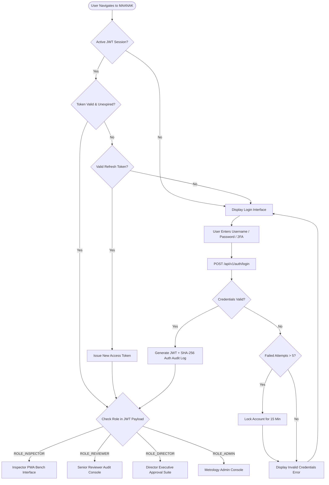
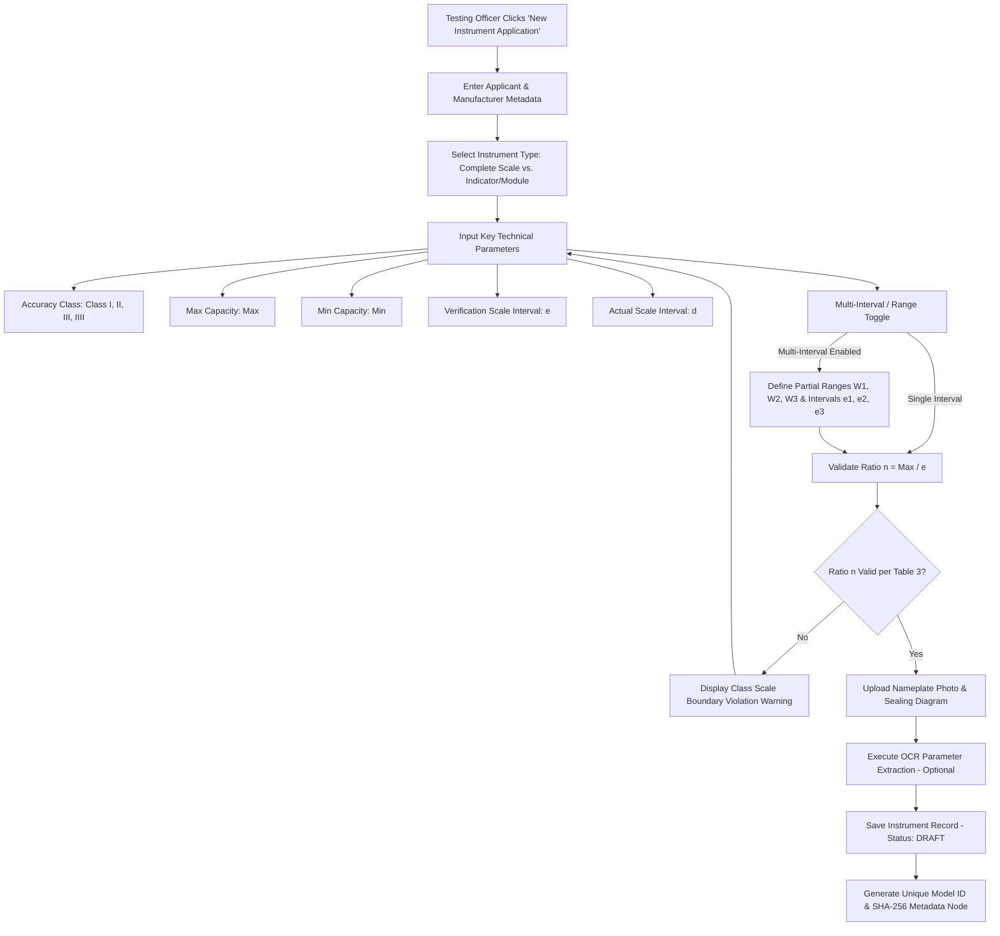
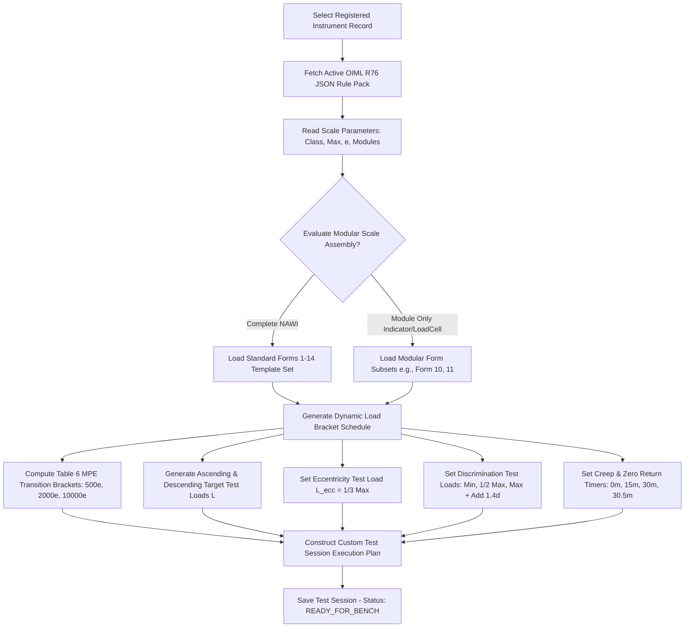
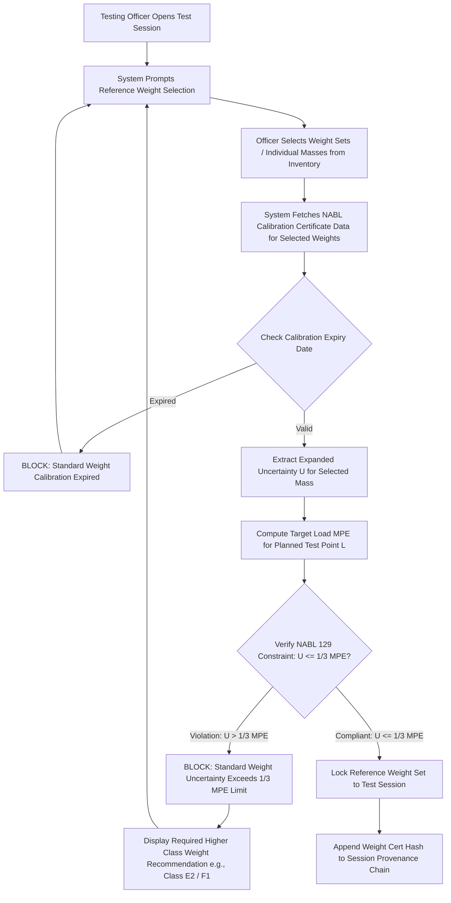
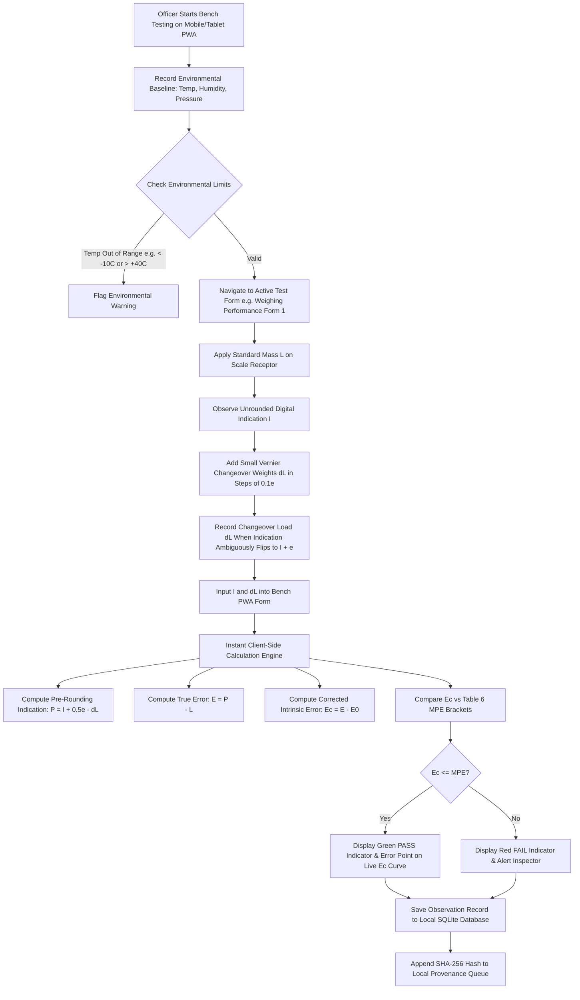
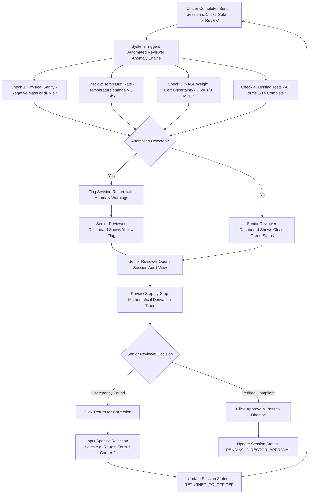
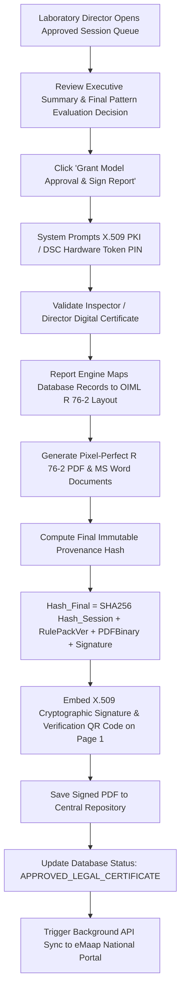
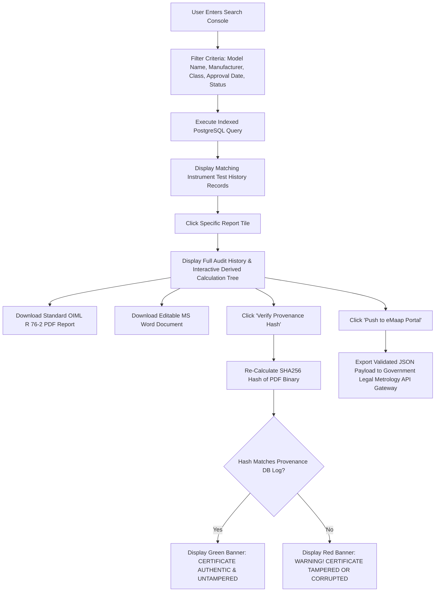
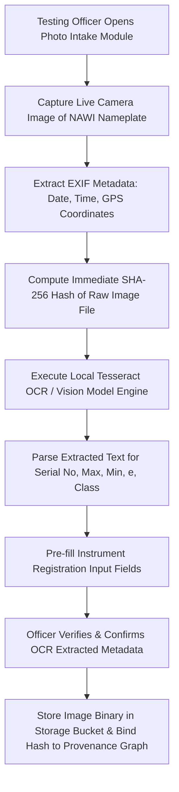
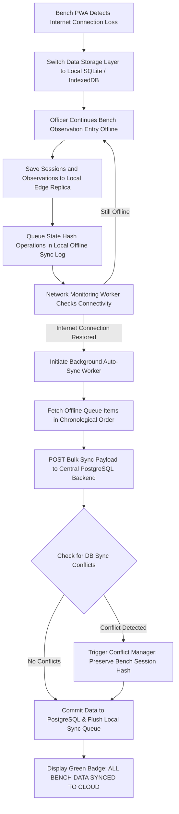

# Application Flow Specification: MAANAK (मानक)

**Software Engine for OIML R-76 NAWI Test Reports & Pattern Evaluation Compliance**  
**Problem Statement:** SIH26035 | **System Name:** MAANAK (मानक)  
**Document Version:** 2.0.0 | **Status:** Implementation-Ready User & System Flow Specification

---

> [!IMPORTANT]
> **Developer & Contributor Directives:**
>
> 1. **Strict Documentation Adherence**: All implementation steps, state machines, and system interactions must strictly adhere to the specifications in this document.
> 2. **Node.js Stack**: The backend architecture is built with **Node.js (LTS v20+ / v22+) & TypeScript** (Prisma ORM, Express/Fastify).
> 3. **Latest Stable Packages**: All npm packages (Next.js 16 LTS v16.3.5, React 19, Prisma, `decimal.js`, `docx`, `pdf-lib`, `zod`, `@phosphor-icons/react`) must use their latest stable releases.
> 4. **Mandatory Mobile Phone Responsiveness**: All user interfaces and bench workflows **must be fully responsive on mobile phones (smartphones 360px–430px)** as well as tablets and desktops.
> 5. **Phosphor React Icons**: All UI iconography across web and PWA bench layouts must exclusively use **`@phosphor-icons/react`**.
> 6. **Deterministic Math**: Use `decimal.js` for zero floating point errors across all calculations.

---

## 1. Executive Overview & Flow Architecture

### 1.1 Purpose

This document defines the complete, step-by-step user, system, data, and exception flows for **MAANAK**, an offline-first, metrologically defensible software platform designed for Non-Automatic Weighing Instruments (NAWI) model approval pattern evaluation under **Section 22 of the Legal Metrology Act, 2009**, **Legal Metrology (Approval of Models) Rules, 2011/2019**, and **OIML Recommendation R 76** (_Part 1: Metrological and Technical Requirements_; _Part 2: Pattern Evaluation Report Format_).

### 1.2 Core Flow Principles

1. **Zero Metrological Drift**: Every calculation ($P = I + 0.5e - \Delta L$, $E = P - L$, $E_c = E - E_0$) is executed deterministically by a backend JSON logic rules engine (`oiml-r76-2006-v1.json`) powered by `decimal.js`. **Zero AI decision-making.**
2. **Offline-First Continuity**: Benchtop observation logging operates completely offline via SQLite edge replicas inside a Progressive Web App (PWA), synchronizing automatically with the central PostgreSQL server upon network restoration.
3. **WELMEC 7.2 Cryptographic Non-Repudiation**: Every state transition appends a SHA-256 hash node to the session's provenance graph before final X.509 PKI digital signing by the Laboratory Director.

---

## 2. User Personas & Authentication / Entry Flow

### 2.1 Role-Based Access Control (RBAC) Matrix

| Persona / Role          | System Role ID   | Entry Points                     | Scope of Authority                                                                                                                                  |
| :---------------------- | :--------------- | :------------------------------- | :-------------------------------------------------------------------------------------------------------------------------------------------------- |
| **Testing Officer**     | `ROLE_INSPECTOR` | Benchtop Mobile PWA / Web Portal | Creates sessions, inputs raw observations ($I, \Delta L$), captures photos, executes live calculation checks. Cannot approve or sign final reports. |
| **Senior Reviewer**     | `ROLE_REVIEWER`  | Web Dashboard                    | Audits calculation step derivation trees, runs automated anomaly checks, flags discrepancies, returns sessions for re-testing.                      |
| **Laboratory Director** | `ROLE_DIRECTOR`  | Web Dashboard (Secure)           | Grants final legal model approval under Section 22, applies X.509 PKI/DSC digital signatures, locks session records immutably.                      |
| **Metrology Admin**     | `ROLE_ADMIN`     | Management Console               | Manages standard weight inventory, updates NABL 129 certs, uploads/activates versioned OIML JSON rule packs.                                        |

---

### 2.2 Entry & Authentication Flow



#### Step-by-Step Entry Procedure:

1. **Access Point**: User opens MAANAK via Web Browser (`https://maanak.rrsl.gov.in`) or offline PWA application.
2. **Session Verification**: System checks local storage / IndexedDB for an active JSON Web Token (`access_token`).
3. **Authentication Execution**:
   - User inputs Username, Password, and 6-digit Time-based OTP (TOTP).
   - System authenticates against PostgreSQL `users` table using Argon2id password hashing.
4. **JWT Generation & Audit**:
   - On success, system issues a 15-minute `access_token` and a 7-day `refresh_token` stored in `HttpOnly` secure cookies.
   - Auth event logged to `provenance_logs` table with client IP, user agent, and timestamp.
5. **Role-Based Routing**: System reads `role_id` claim and redirects user to their persona dashboard.

---

## 3. Phase 1: Instrument Registration & Classification Flow



#### Step-by-Step Registration Procedure:

1. **Application Intake**: Testing Officer selects **"Register New NAWI Model"**.
2. **Manufacturer Information Entry**:
   - Manufacturer Name, Address, Country of Origin, Production Facility.
   - Applicant Name & Contact Details (under Section 22 filing).
3. **Specification Entry**:
   - Model Designation, Serial Number, Pattern Name.
   - Accuracy Class selection: **Class I** (Special), **Class II** (High), **Class III** (Medium), **Class IIII** (Ordinary).
   - Capacity & Division parameters: $Max$, $Min$, $e$, $d$.
4. **Multi-Interval / Range Configuration**:
   - If multi-interval scale: Define partial ranges $W_1, W_2, W_3$ and partial scale intervals $e_1, e_2, e_3$ where $e_1 < e_2 < e_3$.
5. **Scale Boundary Pre-Check**:
   - System calculates ratio $n = \frac{Max}{e}$.
   - Compares $n$ against OIML R 76-1 Table 3 limits:
     - **Class I**: $Min = 100e$, $n_{min} = 50\,000$, $n_{max} = \text{No limit}$.
     - **Class II**: $Min = 20e$ (or $50e$), $n_{min} = 100$, $n_{max} = 100\,000$.
     - **Class III**: $Min = 20e$, $n_{min} = 100$, $n_{max} = 10\,000$.
     - **Class IIII**: $Min = 10e$, $n_{min} = 100$, $n_{max} = 1\,000$.
6. **Metadata Hash Lock**:
   - System saves record in PostgreSQL `instruments` table (`status: REGISTERED`).
   - Computes initial metadata SHA-256 hash node: $\text{Hash}_{\text{Meta}} = \text{SHA256}(\text{Model} + Max + e + \text{Class})$.

---

## 4. Phase 2: Dynamic Test-Plan Generation Flow



#### Step-by-Step Test Plan Generation Procedure:

1. **Rule Pack Resolution**: System fetches active `oiml-r76-2006-v1.json` rule pack.
2. **Form Subset Selection**:
   - Complete Scale $\rightarrow$ Selects R 76-2 Forms 1–14 (Weighing, Temp, Eccentricity, Discrimination, Repeatability, Creep, Tare, Disturbance).
   - Indicator / Digital Device Only $\rightarrow$ Selects Form 10–14 (EMC, ESD, Disturbance).
3. **MPE Step-Bracket Schedule Calculation**:
   - System dynamically computes scale division thresholds ($m = L/e$) and assigns Initial Verification MPE step brackets:
     - $0 \le m \le 500e \implies \pm 0.5e$
     - $500e < m \le 2\,000e \implies \pm 1.0e$
     - $2\,000e < m \le 10\,000e \implies \pm 1.5e$
4. **Target Test Load Grid Generation**:
   - Generates mandatory test load points: $Min$, $500e$, $2\,000e$, $\frac{1}{2}Max$, $Max$.
   - For multi-interval scales, generates bracket transition points for each partial range $W_i$.

---

## 5. Phase 3: Reference Weight Selection & NABL 129 Pre-Validation Flow



#### Step-by-Step NABL 129 Pre-Validation Procedure:

1. **Inventory Lookup**: System queries available standard weight sets in lab inventory (`standard_weights` table).
2. **Calibration Validity Check**: Verifies `calibration_expiry_date > CURRENT_DATE`. If expired, UI displays an amber warning badge and blocks selection.
3. **Algorithmic Uncertainty Verification**:
   - For planned test load $L$, system calculates allowable $\text{MPE}(L)$ in grams.
   - Extracts expanded calibration uncertainty $U$ (at $k=2, 95\%$ confidence level) from NABL calibration cert record.
   - Evaluates boolean condition:
     $$U \le \frac{1}{3} \times \text{MPE}(L)$$
4. **Enforcement Logic**:
   - **Compliant** $\rightarrow$ System binds weight set IDs to session record.
   - **Non-Compliant ($U > \frac{1}{3}\text{MPE}$)** $\rightarrow$ Action strictly **BLOCKED**. UI notifies officer: _"Selected Class M1 weight set uncertainty ($U = 0.6\,\text{g}$) exceeds $1/3 \text{MPE}$ ($0.167\,\text{g}$) for Class II scale at $L=1000\,\text{g}$. Select Class F1 weight set."_

---

## 6. Phase 4: Bench Execution & Offline Observation Capture Flow



#### Step-by-Step Bench Observation Capture Procedure:

1. **Environmental Entry**: Officer logs ambient temperature ($T_1$), relative humidity ($\%RH$), and barometric pressure ($hPa$).
2. **Weighing Run Execution (Ascending & Descending)**:
   - Officer applies standard mass load $L$.
   - Reads displayed unrounded scale indication $I$.
   - Adds small Vernier weights $\Delta L$ in increments of $0.1e$ until scale indication cleanly flips to $I + e$.
   - Officer inputs raw values ($I$, $\Delta L$) into PWA touch screen form.
3. **Real-Time Offline Math Execution**:
   - Client-side WebAssembly / JS math engine instantly calculates:
     $$P = I + 0.5e - \Delta L$$
     $$E = P - L$$
     $$E_c = E - E_0$$
   - Determines active MPE bracket for load $L$ and displays live Pass/Fail badge on bench dashboard.
4. **Local SQLite Persistence**:
   - Observation stored in local SQLite edge replica (`test_observations` table).
   - Offline hash chain node generated: $\text{Hash}_{\text{Obs}} = \text{SHA256}(\text{Load} + I + \Delta L + P + E_c + \text{Timestamp})$.

---

## 7. Phase 5: Deterministic Calculation & Compliance Validation Engine Flow

```mermaid
flowchart TD
    A[Raw Observations Received by Calculation Core] --> B[Parse Active Rule Pack oiml-r76-2006-v1.json]
    B --> C[Select Precision Arithmetic Module - Node.js decimal.js]

    C --> D[Process Zero Load Point L0 = 10e]
    D --> E[Compute Zero Error E0 = I0 + 0.5e - dL0 - L0]

    E --> F[Iterate Through All Test Observations L_i]
    F --> G[Determine Active Scale Range: Single vs Multi-Interval e_i]

    G --> H[Calculate Pre-Rounding Indication P_i = I_i + 0.5e_i - dL_i]
    H --> I[Calculate Raw Error E_i = P_i - L_i]
    I --> J[Calculate Corrected Intrinsic Error E_c,i = E_i - E0]

    J --> K[Lookup Table 6 MPE Limit for Load L_i in Scale Intervals m = L_i / e_i]
    K --> L{Check Condition: |E_c,i| <= MPE_i}

    L -- True --> M1[Mark Point i Status: PASS]
    L -- False --> M2[Mark Point i Status: FAIL]

    M1 & M2 --> N[Generate Step-by-Step Derivation Trace Log]
    N --> O[Compute Aggregate Clause Compliance: PASS if All Points PASS]
```

#### Step-by-Step Calculation Engine Procedure:

1. **Zero Error Baseline ($E_0$) Execution**:
   - Reads zero or near-zero load indication $I_0$ ($L_0 \approx 10e$).
   - Calculates baseline zero error $E_0 = I_0 + 0.5e - \Delta L_0 - L_0$.
2. **Point-by-Point Evaluation**:
   - Loops through every observation $i$ across Forms 1–14.
   - For multi-interval scales, evaluates active partial range $W_k$ and substitutes active interval $e_k$.
   - Computes exact corrected intrinsic error $E_{c,i}$.
3. **Step-Bracket Comparison**:
   - Evaluates $|E_{c,i}| \le \text{MPE}_i$.
   - If even a single point exceeds MPE limit, clause compliance status is flagged **FAIL**.
4. **Derivation Trace Construction**:
   - Engine logs complete JSON step trace:
     `{"step1": "P = 100.0 + 0.5(1.0) - 0.2 = 100.3", "step2": "E = 100.3 - 100.0 = +0.3", "step3": "Ec = 0.3 - 0.1 = +0.2", "mpe": 0.5, "result": "PASS"}`.

---

## 8. Phase 6: Automated Reviewer Anomaly & Correction Workflow



#### Step-by-Step Review & Correction Procedure:

1. **Automated Anomaly Audit**: On submission, system runs automated sanity scripts:
   - **Physical Sanity**: Checks if $\Delta L > e$ or $I < 0$.
   - **Thermal Drift Rate**: Evaluates $\frac{|T_{\text{end}} - T_{\text{start}}|}{\Delta t} \le 5.0\,^\circ\text{C/hour}$ (per R 76-1 Cl A.5.3.2).
   - **Data Completeness**: Verifies all required forms for scale class are filled.
2. **Reviewer Inspection**: Senior Reviewer examines flagged session, inspects vector $E_c$ error graphs, and verifies weight calibration cert links.
3. **Workflow Routing**:
   - **Return for Correction** $\rightarrow$ Unlocks session for Testing Officer; logs rejection reason in audit trail.
   - **Approve Session** $\rightarrow$ Locks session read-only and forwards to Laboratory Director queue.

---

## 9. Phase 7: Report Generation, Cryptographic Provenance & X.509 Signing Flow



#### Step-by-Step Report & Signing Procedure:

1. **Report Mapping**: Report Engine (Node.js `@pdf-lib` / `pdfkit` / `docx`) maps session data to OIML R 76-2 Forms 1–17 layouts.
2. **Vector Graphic Rendering**: Embeds auto-generated $E_c$ vs. Load error curves (Page 41 graph format) directly into PDF binary.
3. **Cryptographic Hash Chain Closure**:
   $$\text{Hash}_{\text{Final}} = \text{SHA256}(\text{Hash}_{\text{Session}} + \text{RulePackID} + \text{PDF}_{\text{Bytes}} + \text{Timestamp})$$
4. **X.509 Digital Signing**: Director enters DSC token PIN; system embeds cryptographically verifiable X.509 signature block and verification QR code.
5. **State Lock**: DB status set to `APPROVED_LEGAL_CERTIFICATE` (Read-only, immutable).

---

## 10. Phase 8: Report History, Search, Retrieval & eMaap Gateway Flow



#### Step-by-Step Search & Gateway Procedure:

1. **Search Query Execution**: Queries PostgreSQL database using indexed fields (`manufacturer_name`, `accuracy_class`, `approval_date`).
2. **Provenance Verification**: Public user or auditor scans QR code on PDF report; system re-calculates SHA-256 binary hash and compares with database provenance registry.
3. **eMaap Government Gateway Sync**: On approval, background worker pushes JSON payload containing Section 22 approval details to national Legal Metrology portal under Rule 11(4).

---

## 11. Phase 9: Evidence, Photo Capture & Nameplate OCR Flow



#### Step-by-Step Evidence Capture Procedure:

1. **Camera Capture**: Officer uses mobile PWA camera to photograph scale nameplate, sealing location, and PCB schematic.
2. **EXIF & Hash Integrity**: System extracts EXIF timestamp/geo-tags and computes SHA-256 image file hash.
3. **OCR Metadata Pre-Fill**: Local OCR parses text bounding boxes for technical specs ($Max, e, \text{Class}$) and pre-fills registration fields.
4. **Binding**: Image record and file hash stored in `evidence_attachments` table.

---

## 12. Phase 10: Offline Storage, SQLite Edge Replica & Sync Flow



#### Step-by-Step Offline Sync Procedure:

1. **Network Disconnection**: Service Worker intercepts API failures and diverts storage operations to local SQLite edge database.
2. **Offline Bench Operation**: Testing Officer completes bench tests normally; WebAssembly math engine calculates live errors offline.
3. **Re-connection & Sync**: On Wi-Fi restoration, sync manager pushes queued SQLite records to backend `/api/v1/sync/bulk` endpoint, verifying SHA-256 hash sequence integrity.

---

## 13. Error & Exception Handling Flows

### 13.1 Metrological Exception Handling Matrix

| Exception Trigger                                  | System Detection Point      | User Action / System Resolution                                                                                                                   |
| :------------------------------------------------- | :-------------------------- | :------------------------------------------------------------------------------------------------------------------------------------------------ |
| **Standard Weight Calibration Expired**            | Phase 3 Weight Selection    | System displays amber badge and **BLOCKS** selection. Officer must choose an active weight set or update NABL cert in Admin panel.                |
| **Weight Uncertainty $U > \frac{1}{3}\text{MPE}$** | Phase 3 Weight Selection    | System **BLOCKS** test execution. UI recommends higher accuracy class weight set (e.g. Class E2 or F1).                                           |
| **Thermal Drift Rate $> 5\,^\circ\text{C/h}$**     | Phase 6 Review Audit        | System flags session with red warning badge. Senior Reviewer requires environmental stabilization and re-testing.                                 |
| **Multi-Interval Scale Range Overflow**            | Phase 4 Bench Execution     | Engine automatically switches active $e_i$ division threshold and alerts officer if Vernier weight $\Delta L$ steps do not match active division. |
| **Database Hash Chain Discrepancy**                | Phase 8 Public Verification | System displays red warning banner: _"Certificate Tampered or Corrupted"_. Invalidates certificate authenticity.                                  |

---

## 14. End-to-End Master Happy Path Sequence Summary

```
[Step 1: Admin Uploads OIML R-76 JSON Rule Pack & NABL Weight Certs]
                           |
                           v
[Step 2: Testing Officer Registers NAWI Model & Captures Nameplate Photo]
                           |
                           v
[Step 3: System Validates Scale Boundaries & Generates Dynamic Test Plan]
                           |
                           v
[Step 4: Officer Selects Standard Weights -> NABL 129 U <= 1/3 MPE Pre-Check PASS]
                           |
                           v
[Step 5: Officer Logs Bench Observations Offline -> Live P, E, Ec Math Execution]
                           |
                           v
[Step 6: Session Pushed to Backend -> Automated Reviewer Anomaly Audit PASS]
                           |
                           v
[Step 7: Senior Reviewer Audits Derivation Step Trees -> Forwards to Director]
                           |
                           v
[Step 8: Lab Director Applies X.509 PKI Signature -> Section 22 Approval Granted]
                           |
                           v
[Step 9: System Generates Signed OIML R 76-2 PDF/Word & Seals SHA-256 Hash Chain]
                           |
                           v
[Step 10: Approved Report Published to Search Archive & Pushed to eMaap Gateway]
```

---

## 15. TBD & Field Verification Items

The following operational flows remain subject to final verification during field validation at Regional Reference Standard Laboratories (RRSLs):

| Flow Parameter                             | Current Operational Assumption                      | Field Verification Required                                                                        |
| :----------------------------------------- | :-------------------------------------------------- | :------------------------------------------------------------------------------------------------- |
| **Bluetooth / RS232 Auto-Ingestion**       | Manual entry of $I$ and $\Delta L$ on touch screen. | Verify if RRSL bench balances feature active RS232/USB streaming output ports.                     |
| **Hardware DSC Token PKCS#11 Integration** | Browser-based X.509 PKI digital signature.          | Confirm specific USB token models (e.g. ePass2003) and middleware used by state officers.          |
| **eMaap REST API Schema**                  | Standalone JSON export module.                      | Obtain official API endpoint schema from the Department of Consumer Affairs for direct cloud sync. |

---
