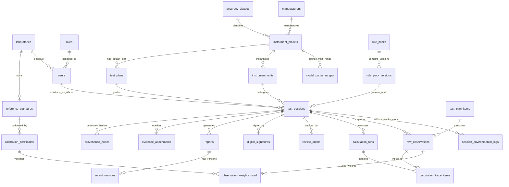

# MAANAK (मानक) — Database Schema & Data Model Specification
**Complete PostgreSQL Schema & Metrological Data Model Specification**  
**Problem Statement:** SIH26035 | **System Name:** MAANAK (मानक)  
**Document Version:** 2.0.0 | **Status:** Implementation-Ready Database Specification  

---

> [!IMPORTANT]
> **Authoritative Developer Directives:**
> 1. **Strict Documentation Adherence**: All database schemas, Prisma models, migrations, and queries must follow this document strictly.
> 2. **Node.js & Prisma Stack**: Use **Prisma ORM (Latest Stable)** with Node.js 20+ LTS / 22 LTS to manage PostgreSQL 16 schema migrations and types.
> 3. **Latest Stable Packages**: Always install and use the latest stable releases of all workspace packages.
> 4. **Lucide React Icons**: All UI iconography across desktop and mobile PWA clients must use **`lucide-react`** (latest stable).
> 5. **Zero Floating Point Errors**: Metrological measurement columns (`NUMERIC(16,8)` / `Decimal`) must strictly map to `decimal.js` instances in TypeScript to eliminate IEEE 754 floating point errors.

---

## 1. Executive Data-Modeling Principles

The **MAANAK (मानक)** database schema is engineered specifically for legal metrology pattern evaluation and verification of Non-Automatic Weighing Instruments (NAWI) under **OIML Recommendation R-76** and **Section 22 of the Legal Metrology Act, 2009**.

To guarantee legal defensibility, auditability, and longevity, the schema adheres to seven core data-modeling principles:

1. **Exact Metrological Decimal Precision (`NUMERIC(16,8)`)**: Floating-point data types (`REAL`, `DOUBLE PRECISION`) are **strictly prohibited** for metrological measurements, scale parameters ($Max, Min, e, d$), load values ($L, I, \Delta L$), and calculated errors ($P, E, E_0, E_c, \text{MPE}$). IEEE 754 binary floating-point representation introduces rounding artifacts (e.g., `0.1 + 0.2 = 0.30000000000000004`). PostgreSQL `NUMERIC(16,8)` paired with `decimal.js` provides exact base-10 fixed-point arithmetic with up to 8 decimal places of sub-milligram precision.
2. **Immutable Raw Measurement Preservation**: Raw bench observations ($I, \Delta L, L, I_0$) are immutably preserved in a separate table (`raw_observations`) from derived or calculated values (`calculation_trace_items`). Raw observations are write-once, read-many (WORM). They are never updated or overwritten.
3. **Standards-as-Code Rule Decoupling**: OIML R-76 mathematical rules, Table 3 scale classification limits, Table 6 MPE step brackets, and formula definitions are stored in versioned JSONB rule packs (`rule_packs` / `rule_pack_versions`). This allows future OIML R-76 revisions or national gazette amendments to be activated dynamically without altering the database DDL or corrupting historical test records.
4. **Deterministic Calculation Replayability**: Every test session (`test_sessions`) explicitly references the exact `rule_pack_version_id`, `instrument_unit_id`, and `calibration_certificate_id`s used during execution. Given the raw observations and the rule pack snapshot, any past calculation can be deterministically replayed and verified bit-for-bit years later.
5. **WELMEC 7.2 Cryptographic Provenance Graph**: Every critical domain event (observation log, environmental reading, calculation run, review audit, digital signature) generates an immutable SHA-256 provenance node (`provenance_nodes`). Each node contains the hash of its predecessor, creating a cryptographic hash chain. Any retrospective database tampering invalidates the chain.
6. **Multi-Tenant Laboratory Isolation & RBAC**: Every table containing operational data includes a `laboratory_id` column. PostgreSQL Row-Level Security (RLS) policies enforce multi-tenant laboratory data isolation across Regional Reference Standard Laboratories (RRSLs) and state verification centers.
7. **Offline-First Synchronization Metadata**: All benchtop tables support offline PWA synchronization via edge-generated `UUID` primary keys (`local_id`), tracking `sync_status` ('PENDING', 'SYNCED', 'CONFLICT'), `device_id`, and `server_synced_at` timestamps.

---

## 2. Complete Entity & Table Summary

| Domain Category | Table Name | Description & Metrological Purpose |
| :--- | :--- | :--- |
| **Identity & RBAC** | `laboratories` | RRSL and state legal metrology testing facilities. |
| | `roles` | System roles (`ROLE_INSPECTOR`, `ROLE_REVIEWER`, `ROLE_DIRECTOR`, `ROLE_ADMIN`). |
| | `users` | User credentials, lab affiliation, and X.509 PKI certificate mappings. |
| | `user_sessions` | JWT authentication sessions and active user security contexts. |
| **Master Data** | `accuracy_classes` | OIML R-76 scale accuracy classes (Class I, II, III, IIII). |
| | `units_of_measure` | SI units and legal units of mass (kg, g, mg, t, ct). |
| | `reference_standards` | Physical standard weight sets (Class E2, F1, M1, M2). |
| | `calibration_certificates` | NABL calibration certificates for standard weights with expanded uncertainty ($U$). |
| **Standards-as-Code** | `rule_packs` | Regulatory standard definition metadata (e.g. OIML R-76). |
| | `rule_pack_versions` | Dynamic versioned JSONB logic rules (Table 3, Table 6 MPE, equations). |
| **Instrument Intake** | `manufacturers` | Scale manufacturers, importers, and applicants under Section 22. |
| | `instrument_models` | NAWI pattern/model specifications ($Max, Min, e, d$, Class). |
| | `model_partial_ranges` | Multi-interval / multiple-range partial scale parameters ($W_1, W_2, e_1, e_2$). |
| | `instrument_units` | Physical individual weighing scale under test (serial number, nameplate photo). |
| **Test Sessions & Plans** | `test_plans` | Standard test sequence schedules generated for an instrument model. |
| | `test_plan_items` | Individual test clauses (A.4.4 Weighing, A.4.7 Eccentricity, A.4.11 Creep). |
| | `test_sessions` | Pattern evaluation test session execution instance. |
| | `session_environmental_logs` | Ambient temperature ($T$), relative humidity (%RH), and barometric pressure. |
| **Observations & Math** | `raw_observations` | Immutable bench observations ($L, I, \Delta L, I_0$, Vernier weights). |
| | `observation_weights_used` | Many-to-many link mapping specific standard weights to observation runs. |
| | `calculation_runs` | Execution container for deterministic R-76 calculation runs. |
| | `calculation_trace_items` | Intermediate mathematical step derivations ($P, E, E_0, E_c, 	ext{MPE}$, Pass/Fail). |
| **Reviews & Signatures** | `review_audits` | Senior officer peer review logs, anomaly flags, and correction assignments. |
| | `digital_signatures` | X.509 PKI / DSC digital signature metadata and PDF hash seals. |
| **Reports & Evidence** | `reports` | Generated OIML R 76-2 pattern evaluation reports. |
| | `report_versions` | PDF/Word document versions, storage paths, and SHA-256 binary hashes. |
| | `evidence_attachments` | Nameplate photos, sealing diagrams, PCB schematics, EXIF metadata. |
| **Audit & Sync** | `provenance_nodes` | WELMEC 7.2 SHA-256 cryptographic provenance hash chain nodes. |
| | `audit_logs` | System security audit trail logs for compliance auditing. |
| | `offline_sync_queue` | PWA offline bench execution sync queue and conflict resolution logs. |

---

## 3. Comprehensive Entity-Relationship Diagram (ERD)



---

## 4. Detailed Table Schemas

### 4.1 Identity & RBAC Domain

#### `laboratories`
Stores testing facility metadata (RRSLs, State Central Laboratories).
```sql
CREATE TABLE laboratories (
    id                  UUID PRIMARY KEY DEFAULT gen_random_uuid(),
    code                VARCHAR(20) NOT NULL UNIQUE, -- e.g., 'RRSL-FARIDABAD'
    name                VARCHAR(255) NOT NULL,
    type                VARCHAR(50) NOT NULL CHECK (type IN ('RRSL', 'STATE_CENTRAL', 'NATIONAL_PHYSICAL_LAB', 'DELEGATED_LAB')),
    address_line1       VARCHAR(255) NOT NULL,
    address_line2       VARCHAR(255),
    city                VARCHAR(100) NOT NULL,
    state               VARCHAR(100) NOT NULL,
    pincode             VARCHAR(10) NOT NULL,
    contact_email       VARCHAR(255) NOT NULL,
    contact_phone       VARCHAR(20) NOT NULL,
    nabl_accreditation_no VARCHAR(100),
    nabl_valid_until    DATE,
    is_active           BOOLEAN NOT NULL DEFAULT TRUE,
    created_at          TIMESTAMPTZ NOT NULL DEFAULT CURRENT_TIMESTAMP,
    updated_at          TIMESTAMPTZ NOT NULL DEFAULT CURRENT_TIMESTAMP
);
```

#### `roles`
Defines system roles and permission sets.
```sql
CREATE TABLE roles (
    id                  UUID PRIMARY KEY DEFAULT gen_random_uuid(),
    code                VARCHAR(50) NOT NULL UNIQUE, -- 'ROLE_INSPECTOR', 'ROLE_REVIEWER', 'ROLE_DIRECTOR', 'ROLE_ADMIN'
    name                VARCHAR(100) NOT NULL,
    description         TEXT,
    permissions_json    JSONB NOT NULL DEFAULT '[]'::jsonb,
    created_at          TIMESTAMPTZ NOT NULL DEFAULT CURRENT_TIMESTAMP
);
```

#### `users`
System user accounts, lab affiliation, and X.509 PKI certificate links.
```sql
CREATE TABLE users (
    id                  UUID PRIMARY KEY DEFAULT gen_random_uuid(),
    laboratory_id       UUID NOT NULL REFERENCES laboratories(id) ON DELETE RESTRICT,
    role_id             UUID NOT NULL REFERENCES roles(id) ON DELETE RESTRICT,
    username            VARCHAR(100) NOT NULL UNIQUE,
    email               VARCHAR(255) NOT NULL UNIQUE,
    password_hash       VARCHAR(255) NOT NULL, -- Argon2id hash
    full_name           VARCHAR(255) NOT NULL,
    designation         VARCHAR(100) NOT NULL, -- e.g. 'Senior Testing Officer'
    government_id_no    VARCHAR(100), -- Employee/Officer ID
    mobile_number       VARCHAR(20) NOT NULL,
    x509_cert_fingerprint VARCHAR(128), -- Public key fingerprint for PKI signing
    is_active           BOOLEAN NOT NULL DEFAULT TRUE,
    last_login_at       TIMESTAMPTZ,
    created_at          TIMESTAMPTZ NOT NULL DEFAULT CURRENT_TIMESTAMP,
    updated_at          TIMESTAMPTZ NOT NULL DEFAULT CURRENT_TIMESTAMP
);
```

---

### 4.2 Master & Reference Data Domain

#### `accuracy_classes`
OIML R-76 scale accuracy classes.
```sql
CREATE TABLE accuracy_classes (
    id                  UUID PRIMARY KEY DEFAULT gen_random_uuid(),
    code                VARCHAR(10) NOT NULL UNIQUE, -- 'I', 'II', 'III', 'IIII'
    name                VARCHAR(50) NOT NULL, -- 'Special', 'High', 'Medium', 'Ordinary'
    min_verification_scale_intervals INT NOT NULL, -- e.g. Class III = 100
    max_verification_scale_intervals INT,          -- e.g. Class III = 10000 (NULL for Class I)
    description         TEXT,
    display_order       INT NOT NULL DEFAULT 0
);
```

#### `reference_standards`
Physical standard weight sets owned by testing laboratories.
```sql
CREATE TABLE reference_standards (
    id                  UUID PRIMARY KEY DEFAULT gen_random_uuid(),
    laboratory_id       UUID NOT NULL REFERENCES laboratories(id) ON DELETE RESTRICT,
    identification_code VARCHAR(100) NOT NULL, -- e.g. 'RRSL-FBD-SET-E2-01'
    oiml_class          VARCHAR(10) NOT NULL CHECK (oiml_class IN ('E1', 'E2', 'F1', 'F2', 'M1', 'M1-2', 'M2', 'M2-3', 'M3')),
    manufacturer_name   VARCHAR(255),
    material            VARCHAR(100), -- Stainless steel, brass, cast iron
    nominal_mass_min    NUMERIC(16,8) NOT NULL, -- e.g. 0.001 kg
    nominal_mass_max    NUMERIC(16,8) NOT NULL, -- e.g. 20.0 kg
    is_active           BOOLEAN NOT NULL DEFAULT TRUE,
    created_at          TIMESTAMPTZ NOT NULL DEFAULT CURRENT_TIMESTAMP,
    CONSTRAINT chk_ref_std_mass CHECK (nominal_mass_max >= nominal_mass_min AND nominal_mass_min > 0)
);
```

#### `calibration_certificates`
NABL accreditation calibration certificates for standard weight sets.
```sql
CREATE TABLE calibration_certificates (
    id                      UUID PRIMARY KEY DEFAULT gen_random_uuid(),
    reference_standard_id   UUID NOT NULL REFERENCES reference_standards(id) ON DELETE RESTRICT,
    certificate_number      VARCHAR(100) NOT NULL UNIQUE,
    calibrating_agency      VARCHAR(255) NOT NULL, -- e.g. 'National Physical Laboratory (NPL)'
    nabl_cert_no            VARCHAR(100) NOT NULL,
    calibration_date        DATE NOT NULL,
    expiry_date             DATE NOT NULL,
    expanded_uncertainty_u  NUMERIC(16,8) NOT NULL, -- In mg or kg, expanded uncertainty U (k=2)
    uncertainty_unit        VARCHAR(10) NOT NULL DEFAULT 'mg',
    coverage_factor_k       NUMERIC(4,2) NOT NULL DEFAULT 2.00,
    certificate_pdf_url     TEXT,
    is_active               BOOLEAN NOT NULL DEFAULT TRUE,
    created_at              TIMESTAMPTZ NOT NULL DEFAULT CURRENT_TIMESTAMP,
    CONSTRAINT chk_cert_dates CHECK (expiry_date > calibration_date),
    CONSTRAINT chk_uncertainty_pos CHECK (expanded_uncertainty_u >= 0)
);
```

---

### 4.3 Standards-as-Code Rules Domain

#### `rule_packs`
Metadata container for regulatory standards.
```sql
CREATE TABLE rule_packs (
    id                  UUID PRIMARY KEY DEFAULT gen_random_uuid(),
    code                VARCHAR(50) NOT NULL UNIQUE, -- 'OIML_R76', 'INDIAN_MODEL_RULES_2011'
    title               VARCHAR(255) NOT NULL,
    issuing_body        VARCHAR(100) NOT NULL, -- 'OIML', 'GOI_LEGAL_METROLOGY'
    description         TEXT,
    created_at          TIMESTAMPTZ NOT NULL DEFAULT CURRENT_TIMESTAMP
);
```

#### `rule_pack_versions`
Dynamic, versioned JSONB logic rules storing Table 3, Table 6 MPE brackets, equations, and testing parameters.
```sql
CREATE TABLE rule_pack_versions (
    id                  UUID PRIMARY KEY DEFAULT gen_random_uuid(),
    rule_pack_id        UUID NOT NULL REFERENCES rule_packs(id) ON DELETE RESTRICT,
    version_tag         VARCHAR(50) NOT NULL, -- e.g., '2006-v1.0.0'
    effective_from      DATE NOT NULL,
    effective_until     DATE, -- NULL if currently active
    is_active           BOOLEAN NOT NULL DEFAULT FALSE,
    rule_schema_version VARCHAR(20) NOT NULL DEFAULT '1.0',
    
    -- Dynamic JSONB rule structures
    table_3_classification_json JSONB NOT NULL, -- Min/Max n, Min capacity rules per class
    table_6_mpe_brackets_json   JSONB NOT NULL, -- Step-bracket boundaries in scale divisions 'e'
    formula_definitions_json    JSONB NOT NULL, -- Math definitions: P, E, E0, Ec, drift rate
    environmental_limits_json   JSONB NOT NULL, -- Temp range, max drift rate (5 K/h), humidity
    
    created_by_user_id  UUID REFERENCES users(id) ON DELETE SET NULL,
    created_at          TIMESTAMPTZ NOT NULL DEFAULT CURRENT_TIMESTAMP,
    CONSTRAINT uq_rule_version UNIQUE (rule_pack_id, version_tag)
);
```

---

### 4.4 Instrument & Model Intake Domain

#### `manufacturers`
Manufacturers, importers, and legal applicants submitting models under Section 22.
```sql
CREATE TABLE manufacturers (
    id                  UUID PRIMARY KEY DEFAULT gen_random_uuid(),
    company_name        VARCHAR(255) NOT NULL,
    trade_license_no    VARCHAR(100) NOT NULL,
    registration_number VARCHAR(100) NOT NULL UNIQUE, -- Legal Metrology manufacturer reg no.
    address_line1       VARCHAR(255) NOT NULL,
    address_line2       VARCHAR(255),
    city                VARCHAR(100) NOT NULL,
    state               VARCHAR(100) NOT NULL,
    country             VARCHAR(100) NOT NULL DEFAULT 'India',
    pincode             VARCHAR(10) NOT NULL,
    contact_person      VARCHAR(255) NOT NULL,
    contact_email       VARCHAR(255) NOT NULL,
    contact_phone       VARCHAR(20) NOT NULL,
    created_at          TIMESTAMPTZ NOT NULL DEFAULT CURRENT_TIMESTAMP,
    updated_at          TIMESTAMPTZ NOT NULL DEFAULT CURRENT_TIMESTAMP
);
```

#### `instrument_models`
NAWI model technical specifications ($Max, Min, e, d$, Class, multi-interval config).
```sql
CREATE TABLE instrument_models (
    id                  UUID PRIMARY KEY DEFAULT gen_random_uuid(),
    manufacturer_id     UUID NOT NULL REFERENCES manufacturers(id) ON DELETE RESTRICT,
    accuracy_class_id   UUID NOT NULL REFERENCES accuracy_classes(id) ON DELETE RESTRICT,
    model_name          VARCHAR(255) NOT NULL,
    pattern_designation VARCHAR(100) NOT NULL UNIQUE, -- Official pattern approval model ID
    instrument_type     VARCHAR(100) NOT NULL, -- e.g. 'Counter Scale', 'Bench Scale', 'Weighbridge'
    weighing_principle  VARCHAR(100) NOT NULL, -- e.g. 'Electronic Strain Gauge Load Cell'
    
    -- Metrological Specs (Primary / Single Range)
    max_capacity        NUMERIC(16,8) NOT NULL, -- Max
    min_capacity        NUMERIC(16,8) NOT NULL, -- Min
    verification_scale_interval_e NUMERIC(16,8) NOT NULL, -- e
    actual_scale_interval_d       NUMERIC(16,8) NOT NULL, -- d
    scale_division_count_n        INT NOT NULL,          -- n = Max / e
    unit_of_measure     VARCHAR(10) NOT NULL DEFAULT 'kg',
    
    -- Range & Interval Architecture Flags
    is_multi_interval   BOOLEAN NOT NULL DEFAULT FALSE, -- Multi-interval instrument
    is_multiple_range   BOOLEAN NOT NULL DEFAULT FALSE, -- Multiple range instrument
    number_of_partial_ranges INT NOT NULL DEFAULT 1 CHECK (number_of_partial_ranges BETWEEN 1 AND 3),
    
    -- Technical Operating Specs
    temp_range_min_c    NUMERIC(4,1) NOT NULL DEFAULT -10.0, -- Default OIML R-76 Tmin
    temp_range_max_c    NUMERIC(4,1) NOT NULL DEFAULT 40.0,  -- Default OIML R-76 Tmax
    power_supply_voltage_nominal NUMERIC(5,1) NOT NULL DEFAULT 230.0, -- Volts AC
    power_supply_frequency_hz    NUMERIC(4,1) NOT NULL DEFAULT 50.0,  -- Hz
    
    firmware_version_id VARCHAR(100) NOT NULL, -- Legal software ID / checksum
    created_at          TIMESTAMPTZ NOT NULL DEFAULT CURRENT_TIMESTAMP,
    updated_at          TIMESTAMPTZ NOT NULL DEFAULT CURRENT_TIMESTAMP,
    
    CONSTRAINT chk_model_capacities CHECK (max_capacity > min_capacity AND min_capacity >= 0),
    CONSTRAINT chk_model_intervals CHECK (verification_scale_interval_e >= actual_scale_interval_d AND actual_scale_interval_d > 0),
    CONSTRAINT chk_model_temp CHECK (temp_range_max_c > temp_range_min_c)
);
```

#### `model_partial_ranges`
Partial weighing ranges ($W_1, W_2, W_3$) for multi-interval / multiple-range scales per Clause 3.3.
```sql
CREATE TABLE model_partial_ranges (
    id                  UUID PRIMARY KEY DEFAULT gen_random_uuid(),
    instrument_model_id UUID NOT NULL REFERENCES instrument_models(id) ON DELETE CASCADE,
    range_index         INT NOT NULL CHECK (range_index BETWEEN 1 AND 3), -- Range 1, 2, or 3
    max_capacity_i      NUMERIC(16,8) NOT NULL, -- Max_i
    min_capacity_i      NUMERIC(16,8) NOT NULL, -- Min_i
    verification_scale_interval_e_i NUMERIC(16,8) NOT NULL, -- e_i
    actual_scale_interval_d_i       NUMERIC(16,8) NOT NULL, -- d_i
    scale_division_count_n_i        INT NOT NULL,          -- n_i = Max_i / e_i
    
    CONSTRAINT uq_model_range INDEX UNIQUE (instrument_model_id, range_index),
    CONSTRAINT chk_partial_capacities CHECK (max_capacity_i > min_capacity_i AND min_capacity_i >= 0),
    CONSTRAINT chk_partial_intervals CHECK (verification_scale_interval_e_i >= actual_scale_interval_d_i AND actual_scale_interval_d_i > 0)
);
```

#### `instrument_units`
Physical individual scale submitted for type evaluation.
```sql
CREATE TABLE instrument_units (
    id                  UUID PRIMARY KEY DEFAULT gen_random_uuid(),
    instrument_model_id UUID NOT NULL REFERENCES instrument_models(id) ON DELETE RESTRICT,
    serial_number       VARCHAR(100) NOT NULL UNIQUE,
    year_of_manufacture INT NOT NULL,
    indicator_serial_no VARCHAR(100),
    load_cell_model_no  VARCHAR(100),
    load_cell_serial_no VARCHAR(100),
    sealing_arrangement_details TEXT,
    created_at          TIMESTAMPTZ NOT NULL DEFAULT CURRENT_TIMESTAMP
);
```

---

### 4.5 Test Sessions & Execution Domain

#### `test_plans`
Template test sequence schedule for an instrument model.
```sql
CREATE TABLE test_plans (
    id                  UUID PRIMARY KEY DEFAULT gen_random_uuid(),
    instrument_model_id UUID NOT NULL REFERENCES instrument_models(id) ON DELETE RESTRICT,
    title               VARCHAR(255) NOT NULL,
    total_test_clauses  INT NOT NULL DEFAULT 0,
    created_at          TIMESTAMPTZ NOT NULL DEFAULT CURRENT_TIMESTAMP
);
```

#### `test_plan_items`
Individual test clause details (Forms 1–14).
```sql
CREATE TABLE test_plan_items (
    id                  UUID PRIMARY KEY DEFAULT gen_random_uuid(),
    test_plan_id        UUID NOT NULL REFERENCES test_plans(id) ON DELETE CASCADE,
    clause_number       VARCHAR(20) NOT NULL, -- 'A.4.4', 'A.4.7', 'A.4.11', 'A.5.3.2'
    form_number         VARCHAR(20) NOT NULL, -- 'Form 1', 'Form 2', 'Form 3'
    title               VARCHAR(255) NOT NULL,
    execution_order     INT NOT NULL,
    is_mandatory        BOOLEAN NOT NULL DEFAULT TRUE,
    CONSTRAINT uq_plan_clause UNIQUE (test_plan_id, clause_number)
);
```

#### `test_sessions`
Pattern evaluation test session execution container.
```sql
CREATE TABLE test_sessions (
    id                  UUID PRIMARY KEY DEFAULT gen_random_uuid(),
    local_id            UUID UNIQUE, -- Edge-generated client UUID for offline sync
    session_number      VARCHAR(100) NOT NULL UNIQUE, -- e.g. 'TS-2026-RRSLFBD-0089'
    laboratory_id       UUID NOT NULL REFERENCES laboratories(id) ON DELETE RESTRICT,
    instrument_unit_id  UUID NOT NULL REFERENCES instrument_units(id) ON DELETE RESTRICT,
    test_plan_id        UUID NOT NULL REFERENCES test_plans(id) ON DELETE RESTRICT,
    rule_pack_version_id UUID NOT NULL REFERENCES rule_pack_versions(id) ON DELETE RESTRICT,
    testing_officer_id  UUID NOT NULL REFERENCES users(id) ON DELETE RESTRICT,
    
    -- Session Lifecycle State
    status              VARCHAR(50) NOT NULL DEFAULT 'DRAFT' 
                        CHECK (status IN ('DRAFT', 'BENCH_IN_PROGRESS', 'CALCULATIONS_COMPLETE', 'UNDER_REVIEW', 'REQUIRES_RETEST', 'APPROVED', 'REJECTED')),
    
    started_at          TIMESTAMPTZ NOT NULL DEFAULT CURRENT_TIMESTAMP,
    completed_at        TIMESTAMPTZ,
    
    -- Sync Metadata
    sync_status         VARCHAR(20) NOT NULL DEFAULT 'SYNCED' CHECK (sync_status IN ('PENDING', 'SYNCED', 'CONFLICT')),
    device_id           VARCHAR(100),
    server_synced_at    TIMESTAMPTZ,
    
    created_at          TIMESTAMPTZ NOT NULL DEFAULT CURRENT_TIMESTAMP,
    updated_at          TIMESTAMPTZ NOT NULL DEFAULT CURRENT_TIMESTAMP
);
```

#### `session_environmental_logs`
Ambient climate observations logged during testing (Clause A.5.3.2).
```sql
CREATE TABLE session_environmental_logs (
    id                  UUID PRIMARY KEY DEFAULT gen_random_uuid(),
    test_session_id     UUID NOT NULL REFERENCES test_sessions(id) ON DELETE CASCADE,
    logged_at           TIMESTAMPTZ NOT NULL DEFAULT CURRENT_TIMESTAMP,
    temperature_c       NUMERIC(4,2) NOT NULL, -- Ambient temp in °C
    relative_humidity_percent NUMERIC(5,2) NOT NULL, -- %RH
    barometric_pressure_hpa NUMERIC(6,2), -- hPa / mbar
    
    -- Automated Drift Checking
    temp_drift_rate_c_per_hr NUMERIC(4,2), -- Calculated thermal drift rate °C/h
    is_temp_stable      BOOLEAN NOT NULL DEFAULT TRUE, -- TRUE if drift <= 5.0 °C/h
    
    CONSTRAINT chk_env_temp CHECK (temperature_c BETWEEN -30.0 AND 70.0),
    CONSTRAINT chk_env_humidity CHECK (relative_humidity_percent BETWEEN 0.0 AND 100.0)
);
```

---

### 4.6 Observations & Calculations Domain

#### `raw_observations`
Immutable bench measurement observations ($L, I, \Delta L, I_0$, position).
```sql
CREATE TABLE raw_observations (
    id                  UUID PRIMARY KEY DEFAULT gen_random_uuid(),
    local_id            UUID UNIQUE, -- Offline client UUID
    test_session_id     UUID NOT NULL REFERENCES test_sessions(id) ON DELETE CASCADE,
    test_plan_item_id   UUID NOT NULL REFERENCES test_plan_items(id) ON DELETE RESTRICT,
    
    sequence_number     INT NOT NULL, -- Test step sequence
    test_clause         VARCHAR(20) NOT NULL, -- e.g. 'A.4.4'
    load_run_direction  VARCHAR(20) NOT NULL CHECK (load_run_direction IN ('ASCENDING', 'DESCENDING', 'NOT_APPLICABLE')),
    
    -- Raw Measurement Values (Fixed-Point NUMERIC)
    target_load_l       NUMERIC(16,8) NOT NULL, -- Applied reference load L
    displayed_indication_i NUMERIC(16,8) NOT NULL, -- Scale reading I
    changeover_weight_dl NUMERIC(16,8) NOT NULL DEFAULT 0.0, -- Added Vernier weights ΔL
    zero_indication_i0  NUMERIC(16,8) NOT NULL DEFAULT 0.0, -- Zero load indication I0
    
    -- Positional & Temporal Metadata
    eccentricity_position INT CHECK (eccentricity_position BETWEEN 1 AND 5), -- Quadrant position (1-5)
    elapsed_time_minutes NUMERIC(6,2), -- For Creep test (e.g. 0.0, 15.0, 30.0 min)
    active_partial_range_index INT NOT NULL DEFAULT 1 CHECK (active_partial_range_index BETWEEN 1 AND 3),
    
    recorded_at         TIMESTAMPTZ NOT NULL DEFAULT CURRENT_TIMESTAMP,
    created_at          TIMESTAMPTZ NOT NULL DEFAULT CURRENT_TIMESTAMP,
    
    -- Raw observations are write-once
    CONSTRAINT uq_obs_sequence UNIQUE (test_session_id, test_plan_item_id, sequence_number)
);
```

#### `observation_weights_used`
Junction table linking standard weight certificates to specific raw observation runs for NABL 129 validation.
```sql
CREATE TABLE observation_weights_used (
    id                      UUID PRIMARY KEY DEFAULT gen_random_uuid(),
    raw_observation_id       UUID NOT NULL REFERENCES raw_observations(id) ON DELETE CASCADE,
    calibration_certificate_id UUID NOT NULL REFERENCES calibration_certificates(id) ON DELETE RESTRICT,
    weight_mass_applied     NUMERIC(16,8) NOT NULL
);
```

#### `calculation_runs`
Execution container for deterministic mathematical evaluation runs.
```sql
CREATE TABLE calculation_runs (
    id                  UUID PRIMARY KEY DEFAULT gen_random_uuid(),
    test_session_id     UUID NOT NULL REFERENCES test_sessions(id) ON DELETE CASCADE,
    rule_pack_version_id UUID NOT NULL REFERENCES rule_pack_versions(id) ON DELETE RESTRICT,
    executed_by_user_id UUID REFERENCES users(id) ON DELETE SET NULL,
    executed_at         TIMESTAMPTZ NOT NULL DEFAULT CURRENT_TIMESTAMP,
    
    -- Session-Level Compliance Result
    overall_compliance_status VARCHAR(20) NOT NULL CHECK (overall_compliance_status IN ('PASS', 'FAIL')),
    total_points_evaluated INT NOT NULL,
    total_points_failed INT NOT NULL DEFAULT 0,
    max_error_to_mpe_ratio NUMERIC(6,4) NOT NULL -- Worst-case |Ec| / MPE ratio
);
```

#### `calculation_trace_items`
Derived mathematical intermediate step values ($P, E, E_0, E_c, 	ext{MPE}$, Pass/Fail status) and step derivation logs.
```sql
CREATE TABLE calculation_trace_items (
    id                  UUID PRIMARY KEY DEFAULT gen_random_uuid(),
    calculation_run_id  UUID NOT NULL REFERENCES calculation_runs(id) ON DELETE CASCADE,
    raw_observation_id  UUID NOT NULL REFERENCES raw_observations(id) ON DELETE CASCADE,
    
    -- Calculated Values (Fixed-Point NUMERIC)
    pre_rounding_indication_p NUMERIC(16,8) NOT NULL, -- P = I + 0.5e - ΔL
    raw_error_e               NUMERIC(16,8) NOT NULL, -- E = P - L
    zero_error_e0             NUMERIC(16,8) NOT NULL DEFAULT 0.0, -- E0
    corrected_intrinsic_error_ec NUMERIC(16,8) NOT NULL, -- Ec = E - E0
    
    -- MPE Tolerance Step-Bracket Comparison
    mpe_limit_applied         NUMERIC(16,8) NOT NULL, -- Applicable MPE tolerance (e.g. ±0.5e)
    mpe_bracket_category      VARCHAR(50) NOT NULL, -- e.g. '0 <= m <= 500e'
    compliance_status         VARCHAR(10) NOT NULL CHECK (compliance_status IN ('PASS', 'FAIL')),
    
    -- Complete Derivation Step Log
    step_derivation_tree_json JSONB NOT NULL, -- Step-by-step math string array for UI tooltips
    created_at                TIMESTAMPTZ NOT NULL DEFAULT CURRENT_TIMESTAMP
);
```

---

### 4.7 Reviews, Approvals & Provenance Domain

#### `review_audits`
Senior metrologist peer review logs and anomaly audit flags.
```sql
CREATE TABLE review_audits (
    id                  UUID PRIMARY KEY DEFAULT gen_random_uuid(),
    test_session_id     UUID NOT NULL REFERENCES test_sessions(id) ON DELETE CASCADE,
    reviewer_user_id    UUID NOT NULL REFERENCES users(id) ON DELETE RESTRICT,
    review_stage        VARCHAR(50) NOT NULL CHECK (review_stage IN ('SECOND_LEVEL_REVIEW', 'DIRECTOR_APPROVAL')),
    decision            VARCHAR(50) NOT NULL CHECK (decision IN ('APPROVED', 'FLAGGED_FOR_CORRECTION', 'REJECTED')),
    comments            TEXT,
    
    -- Anomaly Audit Output Flags
    automated_anomaly_flags_json JSONB NOT NULL DEFAULT '[]'::jsonb,
    reviewed_at         TIMESTAMPTZ NOT NULL DEFAULT CURRENT_TIMESTAMP
);
```

#### `digital_signatures`
X.509 PKI digital signature metadata and PDF binary seal hashes.
```sql
CREATE TABLE digital_signatures (
    id                  UUID PRIMARY KEY DEFAULT gen_random_uuid(),
    test_session_id     UUID NOT NULL REFERENCES test_sessions(id) ON DELETE RESTRICT,
    signer_user_id      UUID NOT NULL REFERENCES users(id) ON DELETE RESTRICT,
    signer_role         VARCHAR(50) NOT NULL, -- 'ROLE_DIRECTOR'
    
    -- Cryptographic Signature Metadata
    pdf_binary_hash_sha256 VARCHAR(64) NOT NULL, -- SHA-256 hash of output PDF
    x509_certificate_serial VARCHAR(100) NOT NULL,
    pki_signature_value_base64 TEXT NOT NULL, -- CMS / PKCS#7 signature string
    timestamp_token_base64     TEXT, -- RFC 3161 cryptographic timestamp token
    
    signed_at           TIMESTAMPTZ NOT NULL DEFAULT CURRENT_TIMESTAMP
);
```

#### `reports`
Generated OIML R 76-2 pattern evaluation report instances.
```sql
CREATE TABLE reports (
    id                  UUID PRIMARY KEY DEFAULT gen_random_uuid(),
    test_session_id     UUID NOT NULL UNIQUE REFERENCES test_sessions(id) ON DELETE RESTRICT,
    report_number       VARCHAR(100) NOT NULL UNIQUE, -- e.g. 'OIML-R76-2026-RRSLFBD-0089'
    pattern_approval_no VARCHAR(100), -- Official Model Approval Cert Number
    current_version_no  INT NOT NULL DEFAULT 1,
    is_signed           BOOLEAN NOT NULL DEFAULT FALSE,
    created_at          TIMESTAMPTZ NOT NULL DEFAULT CURRENT_TIMESTAMP,
    updated_at          TIMESTAMPTZ NOT NULL DEFAULT CURRENT_TIMESTAMP
);
```

#### `report_versions`
Generated PDF and Word document file versions and binary hashes.
```sql
CREATE TABLE report_versions (
    id                  UUID PRIMARY KEY DEFAULT gen_random_uuid(),
    report_id           UUID NOT NULL REFERENCES reports(id) ON DELETE CASCADE,
    version_number      INT NOT NULL,
    file_format         VARCHAR(10) NOT NULL CHECK (file_format IN ('PDF', 'DOCX')),
    file_storage_path   TEXT NOT NULL,
    file_size_bytes     BIGINT NOT NULL,
    file_hash_sha256    VARCHAR(64) NOT NULL, -- Cryptographic file hash
    generated_by_user_id UUID REFERENCES users(id) ON DELETE SET NULL,
    created_at          TIMESTAMPTZ NOT NULL DEFAULT CURRENT_TIMESTAMP,
    CONSTRAINT uq_report_version UNIQUE (report_id, version_number, file_format)
);
```

#### `evidence_attachments`
Nameplate photographs, sealing diagrams, circuit schematics, and EXIF metadata.
```sql
CREATE TABLE evidence_attachments (
    id                  UUID PRIMARY KEY DEFAULT gen_random_uuid(),
    test_session_id     UUID NOT NULL REFERENCES test_sessions(id) ON DELETE CASCADE,
    category            VARCHAR(50) NOT NULL CHECK (category IN ('NAMEPLATE_PHOTO', 'SEALING_DIAGRAM', 'CIRCUIT_SCHEMATIC', 'GENERAL_PHOTO')),
    file_name           VARCHAR(255) NOT NULL,
    file_storage_path   TEXT NOT NULL,
    mime_type           VARCHAR(100) NOT NULL,
    file_hash_sha256    VARCHAR(64) NOT NULL, -- Image hash for tamper protection
    
    -- EXIF & Camera Metadata
    exif_timestamp      TIMESTAMPTZ,
    exif_latitude       NUMERIC(9,6),
    exif_longitude      NUMERIC(9,6),
    ocr_extracted_text_json JSONB, -- Extracted nameplate text ($Max, Min, e, d$)
    
    uploaded_by_user_id UUID REFERENCES users(id) ON DELETE SET NULL,
    created_at          TIMESTAMPTZ NOT NULL DEFAULT CURRENT_TIMESTAMP
);
```

#### `provenance_nodes`
WELMEC Guide 7.2 Extension L cryptographic provenance SHA-256 hash graph.
```sql
CREATE TABLE provenance_nodes (
    id                  UUID PRIMARY KEY DEFAULT gen_random_uuid(),
    test_session_id     UUID NOT NULL REFERENCES test_sessions(id) ON DELETE CASCADE,
    node_sequence       INT NOT NULL, -- Node 1, 2, 3...
    node_type           VARCHAR(50) NOT NULL, -- 'SESSION_INIT', 'OBSERVATION_LOG', 'CALCULATION_RUN', 'REVIEW_AUDIT', 'PDF_SIGN'
    
    -- Cryptographic Hash Graph Links
    previous_node_hash_sha256 VARCHAR(64) NOT NULL, -- Hash of node N-1
    payload_hash_sha256       VARCHAR(64) NOT NULL, -- SHA-256(Node JSON payload)
    current_node_hash_sha256  VARCHAR(64) NOT NULL, -- SHA-256(PreviousHash + PayloadHash)
    
    created_at          TIMESTAMPTZ NOT NULL DEFAULT CURRENT_TIMESTAMP,
    CONSTRAINT uq_session_provenance_seq UNIQUE (test_session_id, node_sequence)
);
```

---

## 5. Offline PWA Synchronization Schema (`offline_sync_queue`)

To support tablet benchtop execution in environments with intermittent Wi-Fi, edge devices run an embedded SQLite database matching these column structures.

```sql
CREATE TABLE offline_sync_queue (
    id                  UUID PRIMARY KEY DEFAULT gen_random_uuid(),
    local_entity_id     UUID NOT NULL, -- Edge SQLite local_id
    entity_table_name   VARCHAR(50) NOT NULL, -- 'raw_observations', 'session_environmental_logs'
    operation_type      VARCHAR(10) NOT NULL CHECK (operation_type IN ('INSERT', 'UPDATE', 'DELETE')),
    payload_json        JSONB NOT NULL,
    client_timestamp    TIMESTAMPTZ NOT NULL,
    
    -- Sync Queue Status
    sync_status         VARCHAR(20) NOT NULL DEFAULT 'PENDING' CHECK (sync_status IN ('PENDING', 'SUCCESS', 'CONFLICT_FAILED')),
    retry_count         INT NOT NULL DEFAULT 0,
    error_message       TEXT,
    synced_at           TIMESTAMPTZ,
    created_at          TIMESTAMPTZ NOT NULL DEFAULT CURRENT_TIMESTAMP
);
```

---

## 6. Database Indexes & Query Optimization Strategy

### 6.1 Index Strategy Matrix

```sql
-- 1. Multi-Tenant Laboratory Isolation Indexes
CREATE INDEX idx_users_lab ON users(laboratory_id);
CREATE INDEX idx_ref_std_lab ON reference_standards(laboratory_id);
CREATE INDEX idx_test_sessions_lab ON test_sessions(laboratory_id);

-- 2. Session Lookup & Filter Indexes
CREATE INDEX idx_test_sessions_status ON test_sessions(status);
CREATE INDEX idx_test_sessions_unit ON test_sessions(instrument_unit_id);
CREATE INDEX idx_test_sessions_officer ON test_sessions(testing_officer_id);

-- 3. Raw Observations High-Speed Ingestion Indexes
CREATE INDEX idx_raw_obs_session_clause ON raw_observations(test_session_id, test_clause, sequence_number);

-- 4. Calculation Trace Items Lookup
CREATE INDEX idx_calc_trace_run ON calculation_trace_items(calculation_run_id);
CREATE INDEX idx_calc_trace_obs ON calculation_trace_items(raw_observation_id);

-- 5. JSONB GIN Indexes for Standards-as-Code & Search
CREATE INDEX idx_rule_pack_mpe_gin ON rule_pack_versions USING GIN (table_6_mpe_brackets_json);
CREATE INDEX idx_rule_pack_formulas_gin ON rule_pack_versions USING GIN (formula_definitions_json);
CREATE INDEX idx_calc_trace_derivation_gin ON calculation_trace_items USING GIN (step_derivation_tree_json);

-- 6. Offline Sync Queue Partial Index
CREATE INDEX idx_sync_queue_pending ON offline_sync_queue(sync_status) WHERE sync_status = 'PENDING';

-- 7. Cryptographic Provenance Chain Lookup
CREATE INDEX idx_provenance_session_seq ON provenance_nodes(test_session_id, node_sequence);
```

---

## 7. PostgreSQL Row-Level Security (RLS) & Multi-Tenancy

To ensure laboratory data isolation between Regional Reference Standard Laboratories (RRSL Faridabad, RRSL Bengaluru, etc.), PostgreSQL Row-Level Security is enabled on operational tables.

```sql
-- Enable RLS on test_sessions
ALTER TABLE test_sessions ENABLE ROW LEVEL SECURITY;

-- Create policy enforcing laboratory isolation
CREATE POLICY lab_isolation_policy ON test_sessions
    FOR ALL
    TO application_role
    USING (laboratory_id = NULLIF(current_setting('app.current_laboratory_id', true), '')::UUID);
```

---

## 8. Example JSON Data Structures

### 8.1 Standards-as-Code Rule Pack JSON (`rule_pack_versions.table_6_mpe_brackets_json`)

```json
{
  "rule_pack_code": "OIML_R76_2006",
  "accuracy_class": "III",
  "mpe_rules": {
    "evaluation_type": "INITIAL_VERIFICATION",
    "step_brackets": [
      {
        "bracket_index": 1,
        "m_min_scale_divisions": 0,
        "m_max_scale_divisions": 500,
        "mpe_factor": 0.5,
        "mpe_formula_display": "±0.5e"
      },
      {
        "bracket_index": 2,
        "m_min_scale_divisions": 501,
        "m_max_scale_divisions": 2000,
        "mpe_factor": 1.0,
        "mpe_formula_display": "±1.0e"
      },
      {
        "bracket_index": 3,
        "m_min_scale_divisions": 2001,
        "m_max_scale_divisions": 10000,
        "mpe_factor": 1.5,
        "mpe_formula_display": "±1.5e"
      }
    ]
  }
}
```

### 8.2 Calculation Trace Derivation Log (`calculation_trace_items.step_derivation_tree_json`)

```json
{
  "clause": "A.4.4",
  "step_number": 4,
  "inputs": {
    "L_target_kg": "15.00000000",
    "I_displayed_kg": "15.00000000",
    "dL_changeover_kg": "0.00300000",
    "e_verification_scale_interval_kg": "0.00500000",
    "E0_zero_error_kg": "0.00000000"
  },
  "derivation_steps": [
    "Step 1: Calculate Pre-Rounding Indication P = I + 0.5e - dL = 15.000 + 0.5(0.005) - 0.003 = 15.00250000 kg",
    "Step 2: Calculate Raw Error E = P - L = 15.0025 - 15.0000 = +0.00250000 kg",
    "Step 3: Calculate Corrected Intrinsic Error Ec = E - E0 = 0.0025 - 0.0000 = +0.00250000 kg (+0.50e)",
    "Step 4: Determine MPE Bracket for L = 15.000 kg (m = L/e = 3000e). Class III bracket 2000e < m <= 10000e -> MPE = ±1.5e (±0.00750000 kg)",
    "Step 5: Compliance Check |Ec| (0.0025 kg) <= MPE (0.0075 kg) -> RESULT: PASS"
  ],
  "result": "PASS"
}
```

---

## 9. Migration & Versioning Strategy

Database DDL migrations are managed using **Prisma Migrate / Version-Controlled SQL Migrations**:
* Migration scripts are version-controlled via Prisma (`prisma/migrations/`).
* DDL changes **never drop columns** containing historical observation or calculation data.
* Regulatory rule changes do **NOT** require DDL migrations — they are ingested as new immutable records in `rule_pack_versions`.

---

## 10. Summary & Implementation Verification

This specification establishes a robust, highly optimized, and legally defensible PostgreSQL data model for **MAANAK**. By combining exact `NUMERIC(16,8)` decimal precision, write-once raw observation preservation, versioned JSONB rules engine integration, and WELMEC 7.2 cryptographic provenance tracking, the database fully satisfies the requirements of **SIH Problem Statement 26035** and **OIML Recommendation R-76**.
