# MAANAK (मानक) — Actionable Implementation Tracker & Dependency State Graph

**Platform for Generation of Test Reports & Compliance Verification for Non-Automatic Weighing Instruments (NAWI) per OIML R-76**  
**Problem Statement:** SIH26035 | **System Name:** MAANAK (मानक)  
**Document Version:** 3.0.0 | **Tracking Standard:** Atomic Task State Engine (READY / BLOCKED / IN_PROGRESS / VERIFIED)

---

> [!IMPORTANT]
> **Authoritative Operational Rules for Agents & Developers:**
>
> 1. **Zero Hallucination Standard**: Work only on tasks in the **`READY`** state. Never start a task in the `BLOCKED` state.
> 2. **One Iteration Per Task**: Each task is sized for a single focused implementation iteration.
> 3. **Unblocking Protocol**: When a task moves from `IN_PROGRESS` to `VERIFIED` (via passing verification commands), identify all tasks blocked by it and re-evaluate their dependency requirements to promote them to `READY`.
> 4. **State Definitions**:
>    - `READY`: All prerequisite tasks are `VERIFIED`. Ready for immediate execution.
>    - `IN_PROGRESS`: Actively being implemented by an AI agent or engineer.
>    - `BLOCKED`: Has one or more unverified prerequisite tasks. The tracker explicitly states the exact tasks needed to unblock it.
>    - `VERIFIED`: Implemented with passing automated tests and committed to the repository.

---

## 1. Executive Implementation State Dashboard

```
+---------------------------------------------------------------------------------------------------+
|                                      TASK EXECUTION STATUS                                        |
+-------------------+-------------------+-------------------+-------------------+-------------------+
|   TOTAL TASKS     |      READY        |    IN_PROGRESS    |      BLOCKED      |     VERIFIED      |
|       63          |        6          |        0          |        48         |        9          |
+-------------------+-------------------+-------------------+-------------------+-------------------+
| PROGRESS: [█████████░░░░░░░░░░░░░░░░░░░░░░░░░░░░░░░░░░░░░░░░░░░░░░░░░░░░░░░░░░░░░] 14.3% Complete   |
+---------------------------------------------------------------------------------------------------+
```

### 1.1 Module Completion Summary

| Module ID  | Module Title                        | Total  | Ready | Blocked | In Progress | Verified | % Complete |
| :--------- | :---------------------------------- | :----: | :---: | :-----: | :---------: | :------: | :--------: |
| **MOD-00** | Monorepo Foundation & Tooling       |   3    |   0   |    0    |      0      |    3     |    100%    |
| **MOD-01** | Shared Types & Domain Schemas       |   5    |   0   |    0    |      0      |    5     |    100%    |
| **MOD-02** | Standards-as-Code Rule Packs        |   5    |   1   |    3    |      0      |    1     |    20%     |
| **MOD-03** | Deterministic Calculation Core      |   8    |   1   |    7    |      0      |    0     |     0%     |
| **MOD-04** | Metrological Compliance Pre-Checks  |   3    |   0   |    3    |      0      |    0     |     0%     |
| **MOD-05** | Database Layer (PostgreSQL/Prisma)  |   4    |   1   |    3    |      0      |    0     |     0%     |
| **MOD-06** | WELMEC 7.2 Cryptographic Signer     |   4    |   1   |    3    |      0      |    0     |     0%     |
| **MOD-07** | Report Generation Engine (PDF/Word) |   4    |   0   |    4    |      0      |    0     |     0%     |
| **MOD-08** | Node.js REST API Gateway            |   10   |   1   |    9    |      0      |    0     |     0%     |
| **MOD-09** | Responsive Mobile Bench PWA & Web   |   12   |   1   |   11    |      0      |    0     |     0%     |
| **MOD-10** | Ground Truth Test Verification      |   5    |   0   |    5    |      0      |    0     |     0%     |
| **TOTAL**  | **Entire MAANAK Platform**          | **63** | **6** | **48**  |    **0**    |  **9**   | **14.3%**  |

---

## 2. Dependency Execution Sequence & Critical Path

The dependency tree guarantees that backend services, database migrations, rules logic, and UI components are built in strict mathematical and structural order:

```mermaid
graph TD
    TASK_001[TASK-001: Monorepo Root] --> TASK_002[TASK-002: Docker & DB]
    TASK_001 --> TASK_003[TASK-003: Workspace Scripts]
    TASK_001 --> TASK_004[TASK-004: Scaffolding @maanak/types]

    TASK_004 --> TASK_005[TASK-005: Metrology Types]
    TASK_004 --> TASK_007[TASK-007: Compliance Types]
    TASK_005 --> TASK_006[TASK-006: Session Types]
    TASK_005 & TASK_006 & TASK_007 --> TASK_008[TASK-008: Zod Schemas]

    TASK_001 --> TASK_009[TASK-009: Rule Pack JSON]
    TASK_008 & TASK_009 --> TASK_010[TASK-010: Rule Loader]
    TASK_010 --> TASK_011[TASK-011: Classifier Table 3]
    TASK_010 --> TASK_012[TASK-012: MPE Engine Table 6]
    TASK_010 & TASK_012 --> TASK_013[TASK-013: Rule Registry]

    TASK_001 --> TASK_014[TASK-014: decimal.js Math Core]
    TASK_014 --> TASK_015[TASK-015: Vernier Indication P]
    TASK_015 --> TASK_016[TASK-016: Corrected Error Ec]
    TASK_014 --> TASK_017[TASK-017: Multi-Interval Resolver]

    TASK_015 & TASK_016 & TASK_017 --> TASK_018[TASK-018: Form 1 Weighing]
    TASK_014 & TASK_015 --> TASK_019[TASK-019: Form 2 Temp Drift]
    TASK_015 & TASK_016 --> TASK_020[TASK-020: Form 3/4 Ecc/Disc]
    TASK_015 & TASK_016 --> TASK_021[TASK-021: Form 5/6 Rep/Creep]

    TASK_012 & TASK_014 --> TASK_022[TASK-022: NABL 129 Gatekeeper]
    TASK_014 & TASK_015 --> TASK_023[TASK-023: Anomaly Detector]
    TASK_011 & TASK_012 --> TASK_024[TASK-024: Test Planner]

    TASK_002 & TASK_005 & TASK_006 --> TASK_025[TASK-025: Prisma Schema]
    TASK_025 --> TASK_026[TASK-026: Prisma Migrations]
    TASK_026 --> TASK_027[TASK-027: DB Seed Script]
    TASK_026 --> TASK_028[TASK-028: DB Client/Repo]

    TASK_007 --> TASK_029[TASK-029: WELMEC SHA-256 Hasher]
    TASK_029 --> TASK_030[TASK-030: Provenance Chain Validator]
    TASK_029 --> TASK_031[TASK-031: X.509 PKI Signer]
    TASK_029 --> TASK_032[TASK-032: Verification QR Code]

    TASK_016 --> TASK_033[TASK-033: Vector Error Curves]
    TASK_031 & TASK_032 & TASK_033 --> TASK_034[TASK-034: OIML PDF Compiler]
    TASK_033 --> TASK_035[TASK-035: Word DOCX Compiler]
    TASK_034 & TASK_035 --> TASK_036[TASK-036: Report Storage]

    TASK_001 & TASK_008 --> TASK_037[TASK-037: Express App Skeleton]
    TASK_028 & TASK_037 --> TASK_038[TASK-038: Argon2 Auth/RBAC]
    TASK_013 & TASK_038 --> TASK_039[TASK-039: Rules API]
    TASK_022 & TASK_028 & TASK_038 --> TASK_040[TASK-040: Weights API]
    TASK_011 & TASK_028 & TASK_038 --> TASK_041[TASK-041: Instruments API]
    TASK_024 & TASK_028 & TASK_038 --> TASK_042[TASK-042: Sessions API]
    TASK_015 & TASK_016 & TASK_028 & TASK_029 --> TASK_043[TASK-043: Observations API]
    TASK_023 & TASK_028 & TASK_038 --> TASK_044[TASK-044: Review Audit API]
    TASK_031 & TASK_034 & TASK_035 & TASK_038 --> TASK_045[TASK-045: Reports API]
    TASK_030 & TASK_038 --> TASK_046[TASK-046: Verify & Sync API]

    TASK_001 & TASK_008 --> TASK_047[TASK-047: Next.js 16 Web Setup]
    TASK_047 --> TASK_048[TASK-048: Mobile Shell & Nav]
    TASK_047 --> TASK_049[TASK-049: Metrology UI Lib]
    TASK_049 --> TASK_050[TASK-050: Mobile Bench Card]
    TASK_048 & TASK_049 --> TASK_051[TASK-051: Dashboard Page]
    TASK_049 --> TASK_052[TASK-052: Instrument Intake]
    TASK_049 --> TASK_053[TASK-053: Weights NABL Page]
    TASK_050 --> TASK_054[TASK-054: Real-time Bench Page]
    TASK_049 --> TASK_055[TASK-055: Review Audit Page]
    TASK_049 --> TASK_056[TASK-056: Report & Signing Page]
    TASK_048 & TASK_049 --> TASK_057[TASK-057: Public QR Page]
    TASK_047 & TASK_054 --> TASK_058[TASK-058: Offline PWA Sync]

    TASK_018 & TASK_043 --> TASK_059[TASK-059: TC-01 Weighing E2E]
    TASK_022 & TASK_040 --> TASK_060[TASK-060: TC-02 NABL PreCheck E2E]
    TASK_017 & TASK_043 --> TASK_061[TASK-061: TC-03 Multi-Interval E2E]
    TASK_019 & TASK_044 --> TASK_062[TASK-062: TC-04 Temp Drift E2E]
    TASK_030 & TASK_046 --> TASK_063[TASK-063: TC-05 WELMEC Tamper E2E]
```



---

## 3. Master Task State & Action Dependency Tracker

| Task ID        | Module | Task Scope & Purpose                                                                               |     State      | Blocked By                                                          | Action to Make READY                                                                        | Verification Target / Test Command                            |
| :------------- | :----- | :------------------------------------------------------------------------------------------------- | :------------: | :------------------------------------------------------------------ | :------------------------------------------------------------------------------------------ | :------------------------------------------------------------ |
| **`TASK-001`** | MOD-00 | Monorepo root workspace initialization (`pnpm-workspace.yaml`, `turbo.json`, `tsconfig.base.json`) | **`VERIFIED`** | None                                                                | Verified with passing `pnpm install` & Turbo config                                         | `pnpm install && pnpm turbo --version`                        |
| **`TASK-002`** | MOD-00 | Docker Compose & PostgreSQL 16 Alpine configuration                                                | **`VERIFIED`** | `TASK-001` (Verified)                                               | Verified via `docker compose config` syntax & health checks                                 | `docker compose config`                                       |
| **`TASK-003`** | MOD-00 | Shared workspace scripts (`build`, `test`, `lint`, `db:*`)                                         | **`VERIFIED`** | `TASK-001` (Verified)                                               | Verified: `pnpm test` & `pnpm format:check` pass across all pkgs                            | `pnpm test && pnpm run format:check`                          |
| **`TASK-004`** | MOD-01 | Scaffolding `@maanak/types` package                                                                | **`VERIFIED`** | `TASK-001` (Verified)                                               | Verified: `pnpm --filter @maanak/types build` generates .d.ts                               | `pnpm --filter @maanak/types build`                           |
| **`TASK-005`** | MOD-01 | Metrological & instrument domain types (`AccuracyClass`, `PartialWeighingRange`)                   | **`VERIFIED`** | `TASK-004` (Verified)                                               | Verified: compiled .d.ts with all OIML R-76 metrology types                                 | `pnpm --filter @maanak/types test`                            |
| **`TASK-006`** | MOD-01 | Test session & observation domain types (`RawObservation`, `CalculationTraceItem`)                 | **`VERIFIED`** | `TASK-004` (Verified), `TASK-005` (Verified)                        | Verified: exported complete session, raw observations, trace items, audit types             | `pnpm --filter @maanak/types test`                            |
| **`TASK-007`** | MOD-01 | NABL 129, WELMEC 7.2 & Provenance types (`ProvenanceNode`, `DigitalSignatureMetadata`)             | **`VERIFIED`** | `TASK-004` (Verified)                                               | Verified: exported NABL 129, WELMEC 7.2 & digital signature types                           | `pnpm --filter @maanak/types test`                            |
| **`TASK-008`** | MOD-01 | Zod validation contracts for API requests/responses                                                | **`VERIFIED`** | `TASK-005` (Verified), `TASK-006` (Verified), `TASK-007` (Verified) | Verified: Zod schemas validate domain fixtures and reject invalid inputs (10/10 tests pass) | `pnpm --filter @maanak/types test`                            |
| **`TASK-009`** | MOD-02 | Dynamic Rule Pack JSON (`oiml-r76-2006-v1.json` Tables 3 & 6)                                      | **`VERIFIED`** | `TASK-001` (Verified)                                               | Verified: complete OIML R-76 rule pack JSON with Tables 3 & 6 (5/5 tests pass)              | `pnpm --filter @maanak/rules-engine test`                     |
| **`TASK-010`** | MOD-02 | Rule Pack Zod Validator & Loader (`loader.ts`)                                                     | **`VERIFIED`** | `TASK-008` (Verified), `TASK-009` (Verified)                        | Verified: RulePackSchema validates OIML R-76 rule pack JSON, handles errors & loads files (13/13 tests pass) | `pnpm --filter @maanak/rules-engine test`                     |
| **`TASK-011`** | MOD-02 | Table 3 NAWI Instrument Classifier ($n = \text{Max}/e$)                                            | **`VERIFIED`** | `TASK-010` (Verified)                                               | Verified: classifyInstrument accurately validates Table 3 boundaries for Classes I-IIII, auxiliary limits & Min (14/14 tests pass) | `pnpm --filter @maanak/rules-engine test`                     |
| **`TASK-012`** | MOD-02 | Table 6 Initial Verification MPE Step Bracket Engine                                               | **`VERIFIED`** | `TASK-010` (Verified)                                               | Verified: getMpe accurately computes ±0.5e, ±1.0e, ±1.5e brackets & absolute mass limits (15/15 tests pass) | `pnpm --filter @maanak/rules-engine test`                     |
| **`TASK-013`** | MOD-02 | Dynamic Rule Pack In-Memory Registry & Hot-Swap                                                    | **`VERIFIED`** | `TASK-010` (Verified), `TASK-012` (Verified)                        | Verified: RulePackRegistry enables runtime hot-swapping & multi-version pack lookups (8/8 tests pass) | `pnpm --filter @maanak/rules-engine test`                     |
| **`TASK-014`** | MOD-03 | Arbitrary-precision math core wrapper with `decimal.js`                                            | **`VERIFIED`** | `TASK-001` (Verified)                                               | Verified: decimal.js configured with 30-digit precision & HALF_UP; eliminates IEEE 754 drift (13/13 tests pass) | `pnpm --filter @maanak/rules-engine test`                     |
| **`TASK-015`** | MOD-03 | Vernier turning point calculator ($P = I + 0.5e - \Delta L, E = P - L$)                            | **`VERIFIED`** | `TASK-014` (Verified)                                               | Verified: calculateIndicationP & calculateRawErrorE accurately compute TC-01 values (6/6 tests pass) | `pnpm --filter @maanak/rules-engine test`                     |
| **`TASK-016`** | MOD-03 | Corrected error ($E_c = E - E_0$) & compliance evaluator                                           | **`VERIFIED`** | `TASK-014` (Verified), `TASK-015` (Verified)                        | Verified: calculateCorrectedErrorEc & evaluateObservationCompliance with TC-01 test matrix (12/12 tests pass) | `pnpm --filter @maanak/rules-engine test`                     |
| **`TASK-017`** | MOD-03 | Multi-interval partial range resolver ($e_1, e_2, e_3$)                                            | **`VERIFIED`** | `TASK-014` (Verified)                                               | Verified: getActiveRangeForLoad, validatePartialRanges, getMultiIntervalMpe (24/24 tests pass) | `pnpm --filter @maanak/rules-engine test`                     |
| **`TASK-018`** | MOD-03 | Form 1 evaluator: Weighing performance & hysteresis                                                | **`VERIFIED`** | `TASK-015` (Verified), `TASK-016` (Verified), `TASK-017` (Verified) | Verified: evaluateForm1Weighing against official TC-01 dataset, hysteresis & zero return (8/8 tests pass) | `pnpm --filter @maanak/rules-engine test`                     |
| **`TASK-019`** | MOD-03 | Form 2 evaluator: Temperature effect on no-load & drift rate                                       | **`VERIFIED`** | `TASK-014` (Verified), `TASK-015` (Verified)                        | Verified: evaluateForm2TemperatureDrift with TC-04 ramp overrun & 0.4e drift (7/7 tests pass) | `pnpm --filter @maanak/rules-engine test`                     |
| **`TASK-020`** | MOD-03 | Form 3 & 4: Eccentricity corner load & 1.4d discrimination                                         | **`VERIFIED`** | `TASK-015` (Verified), `TASK-016` (Verified)                        | Verified: evaluateForm3Eccentricity & evaluateForm4Discrimination with 5-position corner & 1.4d tests (9/9 tests pass) | `pnpm --filter @maanak/rules-engine test`                     |
| **`TASK-021`** | MOD-03 | Form 5 & 6: Repeatability error spread & 30-min creep                                              | **`VERIFIED`** | `TASK-015` (Verified), `TASK-016` (Verified)                        | Verified: evaluateForm5Repeatability & evaluateForm6Creep with 10-rep spread, 30m creep & zero return (8/8 tests pass) | `pnpm --filter @maanak/rules-engine test`                     |
| **`TASK-022`** | MOD-04 | NABL 129 Standard Weight uncertainty gatekeeper ($U \le \frac{1}{3}\text{MPE}$)                    | **`VERIFIED`** | `TASK-012` (Verified), `TASK-014` (Verified)                        | Verified: validateStandardWeightUncertainty & validateStandardWeightSet with TC-02 test matrix (12/12 tests pass) | `pnpm --filter @maanak/rules-engine test`                     |
| **`TASK-023`** | MOD-04 | Metrological sanity & physical anomaly detection engine                                            | **`VERIFIED`** | `TASK-014` (Verified), `TASK-015` (Verified)                        | Verified: AnomalyDetector flags non-monotonicity, excessive deltaL > e, thermal drift & tare anomalies (22/22 tests pass) | `pnpm --filter @maanak/rules-engine test`                     |
| **`TASK-024`** | MOD-04 | Dynamic test plan generator for Forms 1–6                                                          | **`VERIFIED`** | `TASK-011` (Verified), `TASK-012` (Verified)                        | Verified: generateTestPlan creates standard load points for Forms 1-6 tailored to Class/Max/e/d (12/12 tests pass) | `pnpm --filter @maanak/rules-engine test`                     |
| **`TASK-025`** | MOD-05 | Complete Prisma schema with `@db.Decimal(16,8)`                                                    | **`VERIFIED`** | `TASK-002` (Verified), `TASK-005` (Verified), `TASK-006` (Verified) | Verified: 28 models defined with @db.Decimal(16,8), referential integrity & indexes valid | `pnpm --filter @maanak/db prisma validate`                    |
| **`TASK-026`** | MOD-05 | Prisma migration generation & execution                                                            | **`VERIFIED`** | `TASK-025` (Verified)                                               | Verified: 28-table migration SQL generated with 21 DECIMAL(16,8) cols & 38 FKs              | `pnpm --filter @maanak/db migrate:dev` / SQL audit             |
| **`TASK-027`** | MOD-05 | Database seed script (RRSL Lab, Users, Weights, NAWI)                                              | **`VERIFIED`** | `TASK-026` (Verified)                                               | Verified: seed.ts & seed-data.ts seed RRSL, 4 roles/users, E2/F1/M1 weights, NAWI models (16/16 tests pass) | `pnpm --filter @maanak/db test` / `prisma db seed`            |
| **`TASK-028`** | MOD-05 | Prisma client singleton & repository helper functions                                              | **`VERIFIED`** | `TASK-026` (Verified)                                               | Verified: client.ts singleton, repository.ts helpers with Decimal(16,8) & review lock (24/24 tests pass) | `pnpm --filter @maanak/db test` / repo test suite             |
| **`TASK-029`** | MOD-06 | WELMEC 7.2 SHA-256 hash graph node generator                                                       | **`VERIFIED`** | `TASK-007` (Verified)                                               | Verified: hasher.ts with canonical JSON, avalanche divergence & genesis hash (8/8 tests pass)| `pnpm --filter @maanak/crypto-provenance test`                |
| **`TASK-030`** | MOD-06 | Provenance chain validator & SQL tamper detection                                                  |  **`READY`**   | `TASK-029` (Verified)                                               | Ready for immediate execution                                                               | Unit test: detecting single-byte observation change           |
| **`TASK-031`** | MOD-06 | X.509 PKI digital signature service (`@peculiar/x509`)                                             |  **`READY`**   | `TASK-029` (Verified)                                               | Ready for immediate execution                                                               | Unit test: sign digest and verify cert validity               |
| **`TASK-032`** | MOD-06 | Public verification QR code SVG generator                                                          |  **`READY`**   | `TASK-029` (Verified)                                               | Ready for immediate execution                                                               | Unit test: SVG contains correct verification URL              |
| **`TASK-033`** | MOD-07 | Vector error curve SVG generator ($E_c$ vs Load + MPE)                                             | **`BLOCKED`**  | `TASK-016`                                                          | Complete error correction engine                                                            | Visual SVG snapshot test with plotted points                  |
| **`TASK-034`** | MOD-07 | Official OIML R 76-2 multi-page PDF compiler (`@pdf-lib`)                                          | **`BLOCKED`**  | `TASK-031`, `TASK-032`, `TASK-033`                                  | Complete signer, QR, and vector charts                                                      | Unit test: PDF compiles in $< 1.5$s with Forms 1–6            |
| **`TASK-035`** | MOD-07 | Editable Word document (.docx) compiler                                                            | **`BLOCKED`**  | `TASK-033`                                                          | Complete vector charts & report types                                                       | Unit test: generated DOCX opens without corruption            |
| **`TASK-036`** | MOD-07 | Report storage & SHA-256 checksum verification                                                     | **`BLOCKED`**  | `TASK-034`, `TASK-035`                                              | Complete PDF & Word compilers                                                               | Integration test: verify stored checksum matches              |
| **`TASK-037`** | MOD-08 | Express/Fastify application skeleton with security middleware                                      |  **`READY`**   | `TASK-001` (Verified), `TASK-008` (Verified)                        | Ready for immediate execution                                                               | `curl http://localhost:4000/health` returns 200 OK            |
| **`TASK-038`** | MOD-08 | Argon2id authentication & RBAC middleware guards                                                   | **`BLOCKED`**  | `TASK-037` (`TASK-028` Verified)                                    | Complete Express skeleton (`TASK-037`)                                                      | Integration test: login returns JWT; RBAC guards              |
| **`TASK-039`** | MOD-08 | Rule pack management REST routes (`/api/v1/rules`)                                                 | **`BLOCKED`**  | `TASK-013`, `TASK-038`                                              | Complete rule registry & auth middleware                                                    | API test: GET /api/v1/rules returns active pack               |
| **`TASK-040`** | MOD-08 | Standard weight inventory & NABL pre-check routes                                                  | **`BLOCKED`**  | `TASK-022`, `TASK-028`, `TASK-038`                                  | Complete NABL gatekeeper & auth                                                             | API test: POST /weights/precheck returns warning              |
| **`TASK-041`** | MOD-08 | Instrument model registration routes (`/api/v1/instruments`)                                       | **`BLOCKED`**  | `TASK-011`, `TASK-028`, `TASK-038`                                  | Complete Table 3 classifier & auth                                                          | API test: POST /instruments classifies $n = \text{Max}/e$     |
| **`TASK-042`** | MOD-08 | Test session & dynamic plan routes (`/api/v1/sessions`)                                            | **`BLOCKED`**  | `TASK-024`, `TASK-028`, `TASK-038`                                  | Complete test planner & auth                                                                | API test: GET /sessions/:id/plan returns loads                |
| **`TASK-043`** | MOD-08 | Raw observation entry & real-time math API                                                         | **`BLOCKED`**  | `TASK-015`, `TASK-016`, `TASK-028`, `TASK-029`                      | Complete Vernier math & DB repo                                                             | API test: POST /observations returns $P, E_c$, MPE            |
| **`TASK-044`** | MOD-08 | Reviewer anomaly audit routes (`/api/v1/review`)                                                   | **`BLOCKED`**  | `TASK-023`, `TASK-028`, `TASK-038`                                  | Complete anomaly detector & auth                                                            | API test: GET /sessions/:id/audit flags anomalies             |
| **`TASK-045`** | MOD-08 | Report compilation & digital signing routes (`/reports`)                                           | **`BLOCKED`**  | `TASK-031`, `TASK-034`, `TASK-035`, `TASK-038`                      | Complete PDF/DOCX compilers & signer                                                        | API test: POST /reports/sign embeds X.509 signature           |
| **`TASK-046`** | MOD-08 | Public verification & offline sync routes (`/verify`, `/sync`)                                     | **`BLOCKED`**  | `TASK-030`, `TASK-038`                                              | Complete provenance validator & auth                                                        | API test: GET /verify/:hash returns verified status           |
| **`TASK-047`** | MOD-09 | Next.js 16 (LTS v16.3.5) setup & Tweakcn Twitter theme                                             |  **`READY`**   | `TASK-001` (Verified), `TASK-008` (Verified)                        | Ready for immediate execution                                                               | `pnpm --filter @maanak/web build` succeeds                    |
| **`TASK-048`** | MOD-09 | Universal responsive mobile shell & drawer navigation                                              | **`BLOCKED`**  | `TASK-047`                                                          | Complete Next.js 16 & theme setup                                                           | Zero horizontal overflow on 360px viewport                    |
| **`TASK-049`** | MOD-09 | Shared metrological UI library (pills `--radius: 1.3rem`, Phosphor)                                | **`BLOCKED`**  | `TASK-047`                                                          | Complete Next.js 16 & theme setup                                                           | Button touch target $\ge 48\text{px} \times 48\text{px}$ test |
| **`TASK-050`** | MOD-09 | Mobile-first observation card & Vernier keypad component                                           | **`BLOCKED`**  | `TASK-049`                                                          | Complete UI component library                                                               | Card layout test on 375px iPhone screen                       |
| **`TASK-051`** | MOD-09 | Laboratory executive dashboard page (`/dashboard`)                                                 | **`BLOCKED`**  | `TASK-048`, `TASK-049`                                              | Complete responsive shell & UI library                                                      | Responsive test: single col mobile, 4 cols desktop            |
| **`TASK-052`** | MOD-09 | Instrument intake & live Table 3 classification page                                               | **`BLOCKED`**  | `TASK-049`                                                          | Complete UI component library                                                               | Form test: typing Max/e updates class pill                    |
| **`TASK-053`** | MOD-09 | Standard weight inventory & live NABL gatekeeper page                                              | **`BLOCKED`**  | `TASK-049`                                                          | Complete UI component library                                                               | Amber warning banner renders on out-of-spec $U$               |
| **`TASK-054`** | MOD-09 | Real-time bench observation logging page (`/bench`)                                                | **`BLOCKED`**  | `TASK-050`                                                          | Complete mobile observation card                                                            | Instant calculation feedback on $I, \Delta L$ entry           |
| **`TASK-055`** | MOD-09 | Senior reviewer anomaly audit page (`/review`)                                                     | **`BLOCKED`**  | `TASK-049`                                                          | Complete UI component library                                                               | Step derivation tree modal opens cleanly                      |
| **`TASK-056`** | MOD-09 | Report preview & Director X.509 PKI signing page                                                   | **`BLOCKED`**  | `TASK-049`                                                          | Complete UI component library                                                               | Signing PIN dialog triggers report download                   |
| **`TASK-057`** | MOD-09 | Public verification QR landing page (`/verify/[hash]`)                                             | **`BLOCKED`**  | `TASK-048`, `TASK-049`                                              | Complete responsive shell & UI library                                                      | Responsive mobile view verifies SHA-256 hash                  |
| **`TASK-058`** | MOD-09 | Offline PWA Service Worker & IndexedDB sync engine                                                 | **`BLOCKED`**  | `TASK-047`, `TASK-054`                                              | Complete Next.js setup & bench page                                                         | Offline observation entry syncs upon reconnect                |
| **`TASK-059`** | MOD-10 | Ground truth verification TC-01: Class III weighing                                                | **`BLOCKED`**  | `TASK-018`, `TASK-043`                                              | Complete Form 1 engine & observations API                                                   | E2E test runs with 100% assertions passing                    |
| **`TASK-060`** | MOD-10 | Ground truth verification TC-02: NABL 129 violation                                                | **`BLOCKED`**  | `TASK-022`, `TASK-040`                                              | Complete NABL gatekeeper & weights API                                                      | E2E test verifies observation submission locked               |
| **`TASK-061`** | MOD-10 | Ground truth verification TC-03: Multi-interval scale                                              | **`BLOCKED`**  | `TASK-017`, `TASK-043`                                              | Complete multi-interval engine & obs API                                                    | E2E test asserts dynamic interval switching                   |
| **`TASK-062`** | MOD-10 | Ground truth verification TC-04: Temperature drift overrun                                         | **`BLOCKED`**  | `TASK-019`, `TASK-044`                                              | Complete Temp Drift engine & audit API                                                      | E2E test asserts drift violation flagged                      |
| **`TASK-063`** | MOD-10 | Ground truth verification TC-05: WELMEC 7.2 tampering                                              | **`BLOCKED`**  | `TASK-030`, `TASK-046`                                              | Complete provenance validator & sync API                                                    | E2E test asserts SQL tampering detected                       |

---

## 4. Operational Instructions for Next Iteration

1. **`TASK-001`**, **`TASK-002`**, **`TASK-003`**, and **`TASK-004`** have been **`VERIFIED`**.
2. The following tasks are now **`READY`** for immediate execution:
   - **`TASK-005: Metrological & instrument domain types (AccuracyClass, PartialWeighingRange)`** (Domain Types)
   - **`TASK-007: NABL 129, WELMEC 7.2 & Provenance types (ProvenanceNode, DigitalSignatureMetadata)`** (Compliance Types)
   - **`TASK-009: Dynamic Rule Pack JSON (oiml-r76-2006-v1.json)`** (Standards-as-Code)
   - **`TASK-014: Arbitrary-precision math core wrapper with decimal.js`** (Calculation Core)
3. Recommended next step: **`TASK-005`** (Metrological & instrument domain types to progress Module 01 towards unblocking API Zod schemas and DB Prisma schema).
